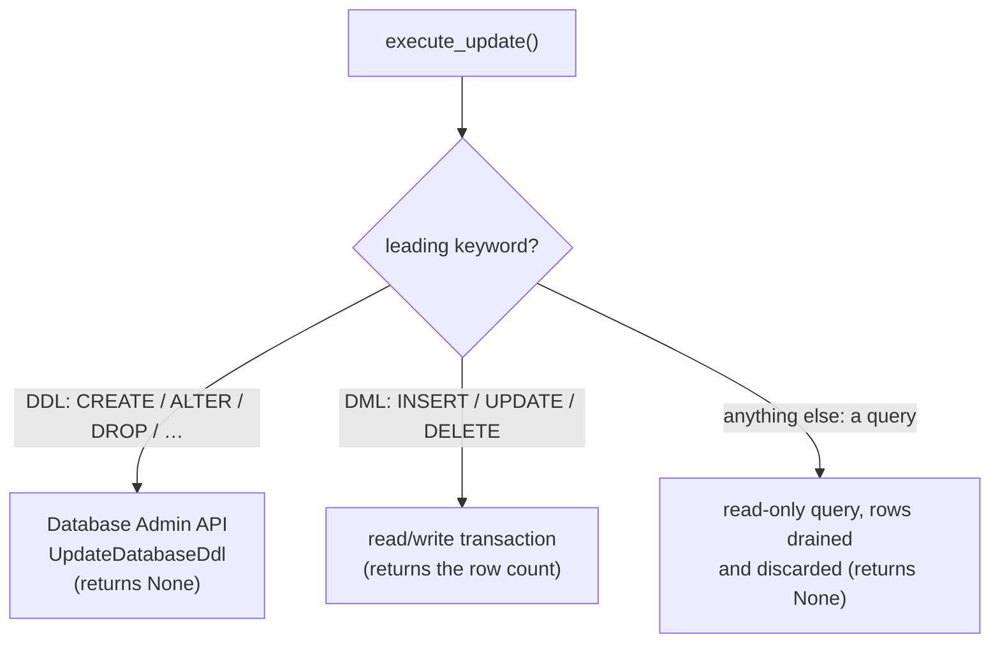

# How the Spanner ADBC driver maps onto ADBC

This document explains how `adbc-spanner` implements the standard
[ADBC](https://arrow.apache.org/adbc/) interface on top of Google Cloud Spanner: the one structural
decision that shapes the code, and what each ADBC operation actually does against Spanner.

It assumes the ADBC concepts themselves. If you have not met them, read
[what ADBC is](https://arrow.apache.org/adbc/current/index.html) and the
[ADBC specification](https://arrow.apache.org/adbc/current/format/specification.html) first — in
particular the four-object hierarchy (driver → database → connection → statement) and Arrow's
`RecordBatch` / `RecordBatchReader` streaming model, both of which this driver simply implements.

For the exhaustive option list see [docs/options.md](options.md); for Spanner's transaction model
and the gRPC calls underneath, [docs/transactions.md](transactions.md). To run the driver, see the
[README](../README.md).

---

## 1. The four objects, in this driver

```
SpannerDriver  ──▶  SpannerDatabase  ──▶  SpannerConnection  ──▶  SpannerStatement
   (the loaded        (which database,        (one session /          (one query /
    driver itself)     credentials, etc.)      transaction scope)       statement to run)
```

| Object | What it represents | Where it lives |
| --- | --- | --- |
| **Driver** | The loaded driver code itself — the entrypoint. | [`src/driver.rs`](../src/driver.rs) |
| **Database** | *Configuration*: which Spanner database, which credentials, which endpoint. No connection is opened yet. | [`src/driver.rs`](../src/driver.rs) |
| **Connection** | A live handle you run work against. Owns transaction state and the metadata calls. | [`src/connection.rs`](../src/connection.rs) |
| **Statement** | A single SQL statement (or bulk-ingest operation) to configure and execute. | [`src/statement.rs`](../src/statement.rs) |

Each is a trait in the `adbc_core` crate, and the driver is, at heart, four Rust structs
implementing those four traits. Options set higher up become defaults lower down: a staleness bound
set on the connection is inherited by every statement it creates, which can then override it.

---

## 2. The entrypoint: loading the shared library

A Rust program adds `adbc-spanner` as a dependency and calls `SpannerDriver::try_new()` directly.
Everything else goes through the **shared library**: built as a `cdylib` the crate compiles to
`libadbc_spanner.so` / `.dylib` / `.dll`, which any ADBC driver manager can load at runtime without
compiling against this crate.

The entire contract between a driver manager and a driver is one exported C symbol. This crate
exports two:

- **`AdbcSpannerInit`** — the driver-specific init symbol. ADBC's naming convention derives it from
  the library name: `libadbc_spanner` → `AdbcSpannerInit`.
- **`AdbcDriverInit`** — a generic fallback name the driver manager tries when the caller does not
  name an explicit entrypoint.

```sh
cargo build --release
nm -D --defined-only target/release/libadbc_spanner.so | grep AdbcSpannerInit
```

Calling the init function yields a table of C function pointers, one per ADBC operation. Each
pointer is a small entry point that translates the C arguments and calls the corresponding method
on the Rust structs. Arrow data itself crosses the boundary through the **Arrow C Data Interface**,
so result sets and bound parameters move without being copied.

That layer is this driver's own code, in [`src/ffi/`](../src/ffi) — `mod.rs` builds the vtable,
`abi.rs` transcribes the C header, and `error.rs`, `guard.rs`, `handle.rs`, `options.rs`,
`stream.rs`, `import.rs` and the three per-object modules hold one concern each. It fills the
vtable for **both** ADBC revisions: a 1.1.0 caller gets the full table (including `ErrorGetDetail*`
and `ErrorFromArrayStream`), while a 1.0.0 caller — which allocated a smaller struct — gets exactly
the 1.0.0 prefix it owns.

Loading from Python needs no Rust:

```python
import adbc_driver_manager
db = adbc_driver_manager.AdbcDatabase(
    driver="/path/to/libadbc_spanner.so",
    entrypoint="AdbcSpannerInit",
    uri="spanner:///projects/p/instances/i/databases/d",
)
```

(The published `adbc-driver-spanner` package bundles the prebuilt library and a DBAPI 2.0 interface,
so you do not have to do this by hand — see [python/README.md](../python/README.md).)

> **Note on `unsafe`.** Crossing the C ABI is the only `unsafe` code in the crate, and all of it is
> confined to `src/ffi/`, where every entry point contains panics (unwinding out of an `extern "C"`
> function would be undefined behaviour). The pure-Rust build (no `ffi` feature) forbids `unsafe`
> outright.

---

## 3. One structural fact that shapes everything: sync over async

The **ADBC traits are synchronous** — `execute()` returns a result, not a future. The Google Cloud
Spanner client is **asynchronous** (async Rust on Tokio). So every driver method bridges the two: it
runs the async Spanner call to completion on a shared Tokio runtime and blocks until it finishes.

```
ADBC method (sync)  ──▶  runtime.block_on(async Spanner call)  ──▶  result
```

There is **one** shared runtime, created once by the driver and passed by `Arc` into every database,
connection and statement. You will see `runtime.block_on(...)` at the boundary of essentially every
operation. That is the whole trick, and it is why the driver never builds a second runtime.

---

## 4. Walking through the interface

### 4.1 Opening a database (configuration)

You ask a `SpannerDriver` for a `SpannerDatabase`, passing options. The one required option is the
standard `uri` option, a `spanner://` **connection URI** whose path is the database path and whose
query parameters pack the endpoint and other database options into the one string:

```
spanner:///projects/p/instances/i/databases/d?spanner.emulator=true
```

A bare database path is not accepted — the `spanner://` scheme is required (write the three-slash
`spanner:///projects/...` form when no endpoint host is intended). The database object is **pure
configuration**: no network happens until a connection is opened. Credentials can come from
Application Default Credentials, a service-account key file, an OAuth access token, or
impersonation; or, for local development, you point at a **Spanner emulator** and use anonymous
credentials. All of it is option plumbing in [`src/driver.rs`](../src/driver.rs).

### 4.2 Opening a connection

`database.new_connection()` builds the actual Spanner client and gives you a `SpannerConnection` —
the object you run work against. It owns the transaction mode (autocommit by default, §4.5) and the
metadata calls (§4.6).

### 4.3 Running a query — `execute`

```rust
let mut statement = connection.new_statement()?;
statement.set_sql_query("SELECT SingerId, FirstName FROM Singers")?;
let reader = statement.execute()?;   // a RecordBatchReader
for batch in reader {
    let batch = batch?;              // one Arrow RecordBatch
    println!("{} rows", batch.num_rows());
}
```

Under the hood:

1. The query runs against Spanner in a single-use read-only transaction (a cheap, lock-free
   snapshot read).
2. `execute()` does **not** pull all the rows. It returns a **lazy** `RecordBatchReader`; each time
   you ask for the next batch, the driver pulls the next bounded chunk of rows (chunk size =
   `spanner.rows_per_batch`, default 8192) and converts just that chunk to Arrow.
3. A background task **prefetches** the next chunk while your code processes the current one.

So a result set of any size streams through bounded memory. The row → Arrow type mapping lives in
[`src/conversion.rs`](../src/conversion.rs); the full table is in the
[README type-mapping section](../README.md#type-mapping).

One mapping is worth calling out, because Arrow is *narrower* than Spanner here: Arrow's nanosecond
timestamp is an `i64` count of nanoseconds, spanning only ~1677–2262, while Spanner `TIMESTAMP`
spans years 0001–9999. By default a value outside that window is a loud `InvalidArguments` error,
never a silently wrapped one; `spanner.max_timestamp_precision=microseconds` maps `TIMESTAMP` to a
microsecond Arrow timestamp instead, covering Spanner's whole range at the cost of truncating
sub-microsecond digits.

DML with a `THEN RETURN` clause also comes back through `execute()` as an Arrow result, since it
produces rows.

### 4.4 Changing data — `execute_update`

`execute_update` returns an **affected-row count** rather than a result stream — or `None` when no
count exists. Which of Spanner's three very different execution surfaces a statement lands on is
decided from its leading keyword (autocommit mode shown; §4.5 covers manual transactions):



- **DML** runs in a Spanner read/write transaction. A `;`-separated batch (e.g. `DELETE; INSERT`)
  is sent as one atomic `ExecuteBatchDml`; such a batch must be **all** DML — mixing in a query or
  DDL is rejected with `InvalidArguments` before anything runs.
- **DDL** is not a normal query in Spanner — it goes through the separate Database Admin API
  (`UpdateDatabaseDdl`), which the driver detects and routes automatically. A `;`-separated DDL
  batch is submitted as a single schema change. DDL reports no row count, so this returns `None`.
- **A query** sent to `execute_update` is legal in ADBC (the caller simply does not want the rows).
  It runs through the same read-only machinery as `execute()`, and its rows are drained and
  discarded; there is no count, so this too returns `None`.

The DML/DDL detection and statement splitting live in [`src/sql.rs`](../src/sql.rs); the execution
in [`src/statement.rs`](../src/statement.rs).

### 4.5 Transactions

By default a connection is in **autocommit** mode: every statement commits on its own. Setting
`adbc.connection.autocommit` to `false` enters **manual** mode, where a transaction is exactly one
kind of work — **queries** or **DML** — fixed by its *first* statement, and DDL is never
transaction-aware.

The full model, its consequences and the gRPC calls behind each path are in
**[docs/transactions.md](transactions.md)**; the `src/connection.rs` module doc is the code-level
version.

### 4.6 Introspection — asking the database about itself

ADBC standardizes a set of **metadata** calls so a generic tool (a data browser, a BI client) can
discover what is in a database without knowing it is Spanner. Each returns its answer as — of
course — an Arrow result:

| ADBC call | Question it answers | How this driver implements it |
| --- | --- | --- |
| `get_info` | "What driver/vendor is this, what version?" | Static metadata ([`src/info.rs`](../src/info.rs)). A code the driver does not recognise (an XDBC-range or vendor-specific one) is *omitted* from the result rather than erroring, as `adbc.h` requires. |
| `get_objects` | "What catalogs / schemas / tables / columns / constraints exist?" | Queries Spanner's `INFORMATION_SCHEMA` ([`src/objects.rs`](../src/objects.rs)). |
| `get_table_schema` | "What is the Arrow schema of table X?" | Reads the table's columns and maps them to an Arrow schema. |
| `get_table_types` | "What kinds of table exist?" | A fixed, typed result set: `BASE TABLE` and `VIEW`. |
| `get_statistics` | "Row counts, distinct counts, null counts." | One aggregate scan per table for exact values — Spanner has no cheaper source, so an `approximate=true` request gets the same exact numbers ([`src/statistics.rs`](../src/statistics.rs)). |
| `get_statistic_names` | "What non-standard statistics exist?" | None — an empty (but correctly typed) result set. |
| `get_parameter_schema` | "What parameters does this statement take?" | If data is already bound, its Arrow schema *is* the answer. Otherwise the `@name` parameters are read out of the SQL and typed by a PLAN-only probe; one the probe cannot type is reported as `Null`, ADBC's "type unknown". |

### 4.7 Parameters and bulk ingest — `bind`

ADBC lets you **bind** an Arrow `RecordBatch` of parameter values to a statement before executing
it. Two uses:

- **Parameterized queries / DML.** Bind one batch whose columns supply the `@param` values. By
  default binding is *positional* (the i-th bound column fills the i-th distinct parameter); set
  `adbc.statement.bind_by_name = true` to match by column name instead.
- **Bulk ingest.** Point a statement at a target table, bind a big `RecordBatch` (or a stream of
  them via `bind_stream`), and the driver writes the rows as native Spanner **insert mutations**,
  not one `INSERT` statement per row, so nothing is SQL-parsed per row. `adbc.ingest.mode` picks the
  behaviour; because Spanner caps how much a single commit may write, a large ingest is committed
  **chunk by chunk** and is therefore not atomic as a whole.

The Arrow → Spanner value mapping and the ingest table-building logic are in
[`src/bind.rs`](../src/bind.rs).

### 4.8 The rest of the surface

- **`execute_schema`** — a query's result schema *without running it*, via a PLAN-only probe.
  Queries only: DML and DDL are rejected, since neither can be planned this way.
- **`execute_partitions` / `read_partition`** — split a large read into independent partitions that
  can be executed in parallel, possibly on different machines. `execute_partitions` produces opaque,
  serializable partition descriptors; `read_partition` executes one and streams its rows. (Security
  note: a descriptor embeds the query and session identity and is *executable* — treat it as a
  credential and only move it over trusted channels.)
- **`cancel`** — interrupt an in-flight operation. The cancel signal is *sticky*: it interrupts the
  current blocking Spanner call and stays latched until the object's next operation, so a cancel
  landing between the chunk fetches of a streamed result still cancels the next fetch.

---

## 5. Configuration, the ADBC way

Everything tunable is an **option** — a string key/value set on one of the four objects with
`set_option` (or the driver manager's `AdbcDatabaseSetOption` / `…ConnectionSetOption` /
`…StatementSetOption`, or Python `db_kwargs` / `conn_kwargs`). Standard, spec-defined options use
the `adbc.*` prefix and mean the same on every ADBC driver; Spanner-specific options use
`spanner.*`. Setting an unknown option fails with `NotImplemented`; reading an unset one fails with
`NotFound`.

[docs/options.md](options.md) is the complete, authoritative reference — every option at every
level, with exact types, defaults, and round-trip behaviour.

---

## 6. Errors

ADBC has its own small set of error **status codes** (`InvalidArguments`, `NotFound`,
`AlreadyExists`, `InvalidState`, `NotImplemented`, `Timeout`, …). Spanner speaks gRPC status codes.
The driver's job at the boundary ([`src/error.rs`](../src/error.rs)) is to **translate**: it maps
each gRPC code onto the closest ADBC status, keeps the original numeric gRPC code in a
`vendor_code` field so nothing is lost, and forwards Spanner's structured error details (quota
failures, bad-request field violations, retry hints) into the ADBC error's `details`. So a caller
gets a portable ADBC status *and* the Spanner-specific specifics if they want them.

A few of the mappings are not one-to-one and are worth knowing: gRPC `PERMISSION_DENIED` becomes
`Unauthorized` (and the driver appends a short hint about granting an IAM role — Spanner's own
message already names the missing permission), `FAILED_PRECONDITION` becomes `InvalidState`,
`DEADLINE_EXCEEDED` becomes `Timeout`, and anything with no close ADBC equivalent falls back to
`Internal` with the original code still in `vendor_code`.

One wrinkle worth knowing if you consume the driver through the **C ABI** at ADBC revision 1.1.0:
that revision's error struct reserves `vendor_code` for a sentinel
(`ADBC_ERROR_VENDOR_CODE_PRIVATE_DATA`) that tells the caller the error carries structured details,
so the driver has to overwrite the numeric gRPC code there. It is not lost — it comes back as an
extra detail keyed `adbc.spanner.vendor_code`, whose value is the code in decimal (`10` for
`ABORTED`), emitted only when the failure had a gRPC status at all. Rust code and C callers on the
older 1.0.0 error layout read the code from `vendor_code` itself.

---

## 7. Where to go next

The natural next reads are the [README](../README.md) for the feature list and type
mapping, [docs/options.md](options.md) for the configuration reference,
[docs/transactions.md](transactions.md) for Spanner's transaction model and the gRPC calls the
driver makes underneath all of the above, and the module-level rustdoc in [`src/`](../src).
