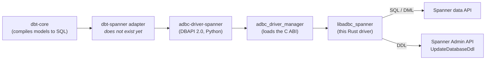
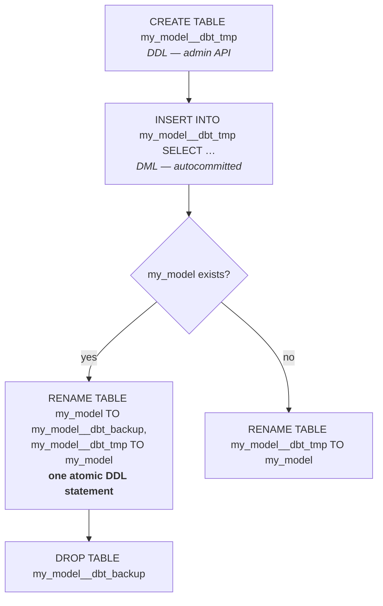

# dbt on Spanner: an autocommit materialization strategy (design sketch)

> **Status: forward-looking design sketch — not an implemented or official adapter.** There is no
> `dbt-spanner` adapter in this repository (or anywhere) today, and nothing on this page is a
> supported feature. It reasons about *how* a future [dbt](https://docs.getdbt.com/) adapter built on
> the `adbc-spanner` driver would implement its core materializations, and why the design is anchored
> on **autocommit** rather than multi-statement transactions. The SQL shown is illustrative: it is
> checked against Cloud Spanner's documented GoogleSQL dialect and against how *this* driver actually
> behaves, but no adapter emits it. See the [README](../README.md) for the driver's real capabilities.

## The pieces



The split on the right is the whole story: **DDL and DML reach Spanner over two different APIs**, so
they can never share a transaction. Everything below follows from that.

## Why Spanner needs its own strategy

A dbt adapter turns a model's compiled `SELECT` into a persisted relation, and re-runs must be
idempotent. The reference adapters lean on two things Spanner does **not** have:

1. **No `CREATE TABLE AS SELECT`.** A table is created by a `CREATE TABLE`
   [schema change](https://cloud.google.com/spanner/docs/schema-updates) (DDL) and populated by a
   separate `INSERT … SELECT` (DML). Building a relation is always two steps, never one statement.
2. **No transactional DDL.** Spanner DDL goes through the admin `UpdateDatabaseDdl` API and each
   schema change commits on its own. A `;`-separated DDL batch is applied
   [near-atomically](https://cloud.google.com/spanner/docs/schema-updates) but is not truly atomic,
   and DDL can never join a read/write transaction alongside DML.

So "wrap the build in one transaction and roll back on failure" is unavailable at the SQL layer, in
any client. The conclusion — matching
[`dbt-bigquery`](https://docs.getdbt.com/reference/resource-configs/bigquery-configs) on a similarly
non-transactional-DDL warehouse — is to run in **autocommit** and get atomicity from a single
**atomic `RENAME TABLE` swap** instead of a long transaction.

## Why autocommit, concretely

This driver defaults to autocommit. Setting `adbc.connection.autocommit=false` enters a manual mode
that **buffers** DML and applies it in one read/write transaction at `commit`. For a dbt
materialization that mode is the wrong tool, for three independent reasons:

- **One kind of work per transaction.** A manual transaction is exactly one of **queries or DML**,
  fixed by its first statement; a statement of the other kind fails with `InvalidState` until
  `commit`/`rollback`.
- **No read-your-writes.** Writes stay buffered until commit, so a query could never see them —
  rather than silently returning the pre-insert state, the driver **rejects** the query (the rule
  above). A build that reads a table it just wrote fails loudly instead of being quietly wrong, but
  it still cannot work as written.
- **DDL is not in the transaction at all.** DDL executes immediately through the admin API, so a
  `CREATE TABLE` issued *after* a buffered `INSERT` actually runs *before* it, and `rollback` cannot
  undo it. Program order across DDL and buffered DML is not preserved.

Autocommit sidesteps all of this: **each statement commits before the next runs**, so a table that
step *N* writes is fully visible to step *N+1* and the sequence reads like ordinary sequential SQL.
The price — no cross-statement atomicity — is paid back by making the *only* step that publishes the
new data a single atomic one.

> **Do not** set `adbc.connection.autocommit=false` around a multi-step materialization expecting to
> read intermediate writes back. Use autocommit plus a rename swap.

See [docs/transactions.md](transactions.md) for the full transaction semantics.

## Dialect notes the adapter must honour

- **Every table needs an explicit `PRIMARY KEY`.** Spanner has no implicit `rowid`. Every model needs
  a key — from a configured `unique_key`, or a surrogate. A keyless model is not expressible.
- **Backtick identifier quoting**: `` `my_model` ``.
- **[GoogleSQL types](https://cloud.google.com/spanner/docs/data-types)**: `INT64`, `FLOAT64`,
  `NUMERIC`, `BOOL`, `STRING(MAX)` / `STRING(n)`, `BYTES(MAX)`, `DATE`, `TIMESTAMP`, `JSON`,
  `ARRAY<…>`. There is no `INT`/`VARCHAR`/`TEXT`.
- **No `MERGE`.** Spanner's
  [GoogleSQL DML](https://cloud.google.com/spanner/docs/reference/standard-sql/dml-syntax) is
  `INSERT` / `UPDATE` / `DELETE` only. Upserts are spelled `INSERT OR UPDATE` (or `INSERT … ON
  CONFLICT … DO UPDATE`) — see [Incremental](#incremental-materialization). Both accept a `SELECT`
  as their input, so an upsert-from-query is one statement.
- **No joins in `UPDATE`.** `UPDATE … FROM other_table` does not exist; correlate with a subquery in
  the `SET` expression or `WHERE` clause instead. Primary-key columns cannot be `UPDATE`d.
- **No partitioned DML here.** Spanner's partitioned DML supports only `UPDATE`/`DELETE`
  ([`INSERT` is unsupported](https://cloud.google.com/spanner/docs/dml-partitioned)), and this
  driver exposes no way to request it — so it is not an escape hatch for large loads.

## Table materialization

Full-refresh build of a model as a physical table. There is no CTAS, so: build under a temporary
name, populate it, then **swap atomically**.



```sql
-- 1. DDL: create the temp table. Every table needs a PRIMARY KEY.
CREATE TABLE `my_model__dbt_tmp` (
  `id`         INT64        NOT NULL,
  `name`       STRING(MAX),
  `amount`     NUMERIC,
  `updated_at` TIMESTAMP,
) PRIMARY KEY (`id`);

-- 2. DML: populate from the model's compiled SELECT (autocommitted).
INSERT INTO `my_model__dbt_tmp` (`id`, `name`, `amount`, `updated_at`)
SELECT `id`, `name`, `amount`, `updated_at`
FROM ( /* the model's compiled SQL */ );

-- 3. Publish. RENAME TABLE renames several tables *simultaneously*, so this one
--    statement is atomic: readers see the old table or the new one, never neither.
RENAME TABLE `my_model` TO `my_model__dbt_backup`,
             `my_model__dbt_tmp` TO `my_model`;

-- 4. Clean up the displaced table (DDL, separate, not on the critical path).
DROP TABLE `my_model__dbt_backup`;
```

Notes and caveats:

- **Where the column types come from.** The adapter can get the model's output schema from a
  `QueryMode::Plan` probe of the compiled SQL — the driver's `execute_schema`, which analyses the
  query and returns column metadata *without scanning data* — mapping each Arrow field back to a
  GoogleSQL type, plus the model's configured key. There is no server-side "create a table shaped
  like this query" shortcut.
- **The swap is genuinely atomic.**
  [`RENAME TABLE`](https://cloud.google.com/spanner/docs/table-name-synonym) "renames a table or
  multiple tables simultaneously", which is exactly the swap primitive a drop-then-rename pair lacks
  — there is no window in which `my_model` does not exist. It is one DDL statement, so it needs no
  cross-statement atomicity from the driver (which classifies `RENAME` as DDL and routes it to
  `UpdateDatabaseDdl` like any other schema change).
- **First run.** `RENAME TABLE` has no `IF EXISTS`, so the two-rename form only works once
  `my_model` exists; the adapter must check first (`get_objects` / `get_table_schema`) and emit the
  single-rename form otherwise.
- **Indexes.** Renaming updates references from indexes, foreign keys and change streams
  automatically, but a table cannot be `DROP`ped while indexes exist over it — so step 4 drops the
  backup's indexes first, and any index the model wants must be recreated on the new table.
- **Volume.** A large `INSERT … SELECT` runs in one read/write transaction and is bounded by
  Spanner's per-transaction [mutation limit](https://cloud.google.com/spanner/quotas). Partitioned
  DML cannot help (`INSERT` is unsupported there), so very large refreshes need key-range-chunked
  statements or the bulk-ingest path below.

## Incremental materialization

Insert or update only the new/changed rows. Because Spanner has no `MERGE`, the upsert is an
`INSERT OR UPDATE`, whose input may be a `SELECT` — so the common case is **one autocommitted
statement, no staging table**:

```sql
INSERT OR UPDATE INTO `my_model` (`id`, `payload`, `updated_at`)
SELECT `id`, `payload`, `updated_at`
FROM ( /* the model's compiled SQL, filtered by its is_incremental() predicate */ );
```

- **`INSERT OR UPDATE` conflicts on the primary key.** So the model's configured `unique_key` must
  *be* the table's primary key (a composite `unique_key` → a composite key, in that order). To key on
  a unique secondary index instead, the `ON CONFLICT` spelling takes an explicit conflict target
  (`INSERT INTO my_model (…) (SELECT …) ON CONFLICT (id) DO UPDATE SET …`). `INSERT OR …` and
  `ON CONFLICT` cannot be mixed in one statement.
- **`OR UPDATE` overwrites only the listed columns**, replacing them wholesale; there is no
  `WHEN MATCHED AND <condition>` guard. A conditional update needs the `ON CONFLICT … DO UPDATE …
  WHERE` form.
- **delete+insert.** For a delete-then-insert `incremental_strategy`, stage the slice first so the
  model's SQL is evaluated once — and because each step autocommits, the staging table is fully
  visible to the next statement (the exact thing manual mode would break):

  ```sql
  CREATE TABLE `my_model__dbt_tmp` (`id` INT64 NOT NULL, `payload` STRING(MAX)) PRIMARY KEY (`id`);
  INSERT INTO `my_model__dbt_tmp` (`id`, `payload`) SELECT `id`, `payload` FROM ( /* model SQL */ );
  DELETE FROM `my_model` WHERE `id` IN (SELECT `id` FROM `my_model__dbt_tmp`);
  INSERT INTO `my_model` (`id`, `payload`) SELECT `id`, `payload` FROM `my_model__dbt_tmp`;
  DROP TABLE `my_model__dbt_tmp`;
  ```

  The `DELETE` and `INSERT` are separate transactions, so a failure between them leaves rows deleted
  but not re-inserted — the price of no CTAS and no cross-statement atomicity. Where that matters,
  fall back to the full table-swap above.

**On-schema-change.** Spanner alters columns via DDL (`ALTER TABLE … ADD COLUMN` / `DROP COLUMN`, one
column at a time, each auto-committing), so `append_new_columns` / `sync_all_columns` map to generated
`ADD COLUMN` / `DROP COLUMN` run before the upsert; `fail` compares the target's schema
(`get_table_schema`) against the model's `execute_schema` probe and aborts on drift. Spanner has no
cheap in-place type change, so an incompatible type change realistically falls back to a full rebuild.

## Snapshot materialization (SCD Type 2)

Snapshots track history: each source row version is a row with `dbt_valid_from` / `dbt_valid_to`
bounds and a `dbt_scd_id` surrogate. Every step is a complete, autocommitted statement that reads the
snapshot table's committed state — no read-your-writes dependency, so autocommit is exactly right.

```sql
-- 1. Close out rows whose tracked columns changed or that vanished from the source.
--    No UPDATE ... FROM in Spanner: correlate with subqueries instead.
UPDATE `my_snapshot` AS t
SET t.`dbt_valid_to` = @snapshot_ts
WHERE t.`dbt_valid_to` IS NULL
  AND t.`dbt_scd_id` NOT IN (
    SELECT s.`dbt_scd_id` FROM ( /* source, with a computed dbt_scd_id */ ) AS s
  );

-- 2. Insert the new versions (and brand-new rows) as open-ended records.
INSERT INTO `my_snapshot` (`dbt_scd_id`, /* … business columns … */,
                           `dbt_valid_from`, `dbt_valid_to`)
SELECT s.`dbt_scd_id`, /* … */, @snapshot_ts, NULL
FROM ( /* source */ ) AS s
WHERE s.`dbt_scd_id` NOT IN (SELECT `dbt_scd_id` FROM `my_snapshot`);
```

- `dbt_scd_id` — a stable hash over the source key plus the tracked columns (`check` strategy) or an
  updated-at column (`timestamp` strategy) — is the natural **`PRIMARY KEY`**, which Spanner requires
  anyway. A changed row hashes to a *new* `dbt_scd_id`, so step 1 closes the old version and step 2
  inserts the new one.
- Ordering matters (close out before insert). Because each step commits, a failure between them
  leaves a well-defined, inspectable intermediate state rather than a torn transaction, and re-running
  converges.

## Seeds → bulk ingest

A dbt `seed` loads a CSV as a table. That maps onto the driver's
[bulk-ingest](../README.md#status) path rather than row-by-row `INSERT` DML: set
`adbc.ingest.target_table` and hand over an Arrow table (in Python, `cur.adbc_ingest(table, data,
mode=…)`), which the driver writes as native **insert mutations** — nothing is SQL-parsed or planned
per row. Relevant knobs (full list in [docs/options.md](options.md#statement-options)):

- **`adbc.ingest.mode`** — `create` / `create_append` / `replace` build the table from the seed's
  Arrow schema; `append` requires it to exist.
- **Primary key.** A create mode adds a synthetic `adbc_ingest_key` `STRING(36)` UUID primary key
  unless **`spanner.ingest.primary_key`** names existing seed columns to key on, in key order — what
  a seed config declaring a primary key would set, so no synthetic column appears.
- **`spanner.ingest.batch_write`** — routes each autocommit chunk through Spanner's BatchWrite RPC
  (non-atomic per row group, higher throughput) for large seeds. Chunking, insert semantics and the
  row count are preserved.

A large seed commits chunk by chunk under Spanner's per-commit mutation limits, so it is **not atomic
as a whole** — a mid-load failure leaves earlier chunks committed and reports the exact row count
already written. That suits dbt's "a seed is a full rebuild of a static table" expectation; where the
visible relation must flip atomically, ingest into a temp name and reuse the `RENAME TABLE` swap.

## Connectivity and useful profile options

The adapter would drive this driver from Python via the
[`adbc-driver-spanner`](../python/README.md) package plus `adbc_driver_manager`, which exposes the
standard **DBAPI 2.0** connection/cursor surface (with Arrow result fetching) that a dbt adapter's
connection manager wraps:

```python
import adbc_driver_spanner.dbapi as spanner
from adbc_driver_spanner import DatabaseOptions

conn = spanner.connect(
    db_kwargs={
        # The database path travels in the standard `uri` option; the `spanner:` scheme is required.
        DatabaseOptions.URI.value: "spanner:///projects/p/instances/i/databases/d",
        DatabaseOptions.KEYFILE.value: "/path/to/service-account.json",  # or omit for ADC
    },
    # DBAPI defaults to autocommit=False. An adapter must opt in explicitly.
    autocommit=True,
)
```

A `profiles.yml` entry maps cleanly onto this: the database path is the `uri` option, and credentials
are the driver's `spanner.auth.*` keys (`spanner.auth.keyfile`, `spanner.auth.keyfile_json`,
`spanner.auth.access_token`, `spanner.auth.impersonate.target_principal`,
`spanner.auth.quota_project`) — or nothing at all, which falls back to Application Default
Credentials.

Beyond credentials, several options are directly useful in a profile or per-model config (all in
[docs/options.md](options.md)):

- **`spanner.read.staleness`** — a stale read (`max:10s`, `exact:30s`) makes read-only model queries
  cheaper and lock-free. Good on analytics models where slightly stale input is fine; leave unset
  (strong read) where freshness matters. Settable per statement, so it can be a per-model knob.
- **`spanner.request.priority`** / **`spanner.request.tag`** / **`spanner.transaction.tag`** — tag dbt
  runs (`spanner.request.tag = dbt-run-<invocation_id>`) for
  [troubleshooting-with-tags](https://cloud.google.com/spanner/docs/introspection/troubleshooting-with-tags)
  visibility, and drop batch/backfill models to `low` priority so they yield to serving traffic.
- **`spanner.rpc.timeout_seconds.*`** / **`spanner.retry.*`** — bound long-running model builds and
  tune retries for flaky CI networks.

## Summary

Spanner has no CTAS and no transactional DDL, so a dbt adapter cannot lean on transaction-wrapped
builds — and this driver's manual mode (one kind of work per transaction, buffered DML, no
read-your-writes, DDL applied immediately and out of order) makes wrapping a materialization in
`autocommit=false` actively incorrect. The workable design, mirroring `dbt-bigquery`, runs entirely in
**autocommit** so each step is committed and visible to the next, and takes its atomicity from a
single **`RENAME TABLE` swap** for tables and from individually-complete **`INSERT OR UPDATE`**
statements for incremental and snapshot models. Seeds ride the driver's native bulk-ingest path. None
of this is implemented; this page is the design rationale for a future adapter.
