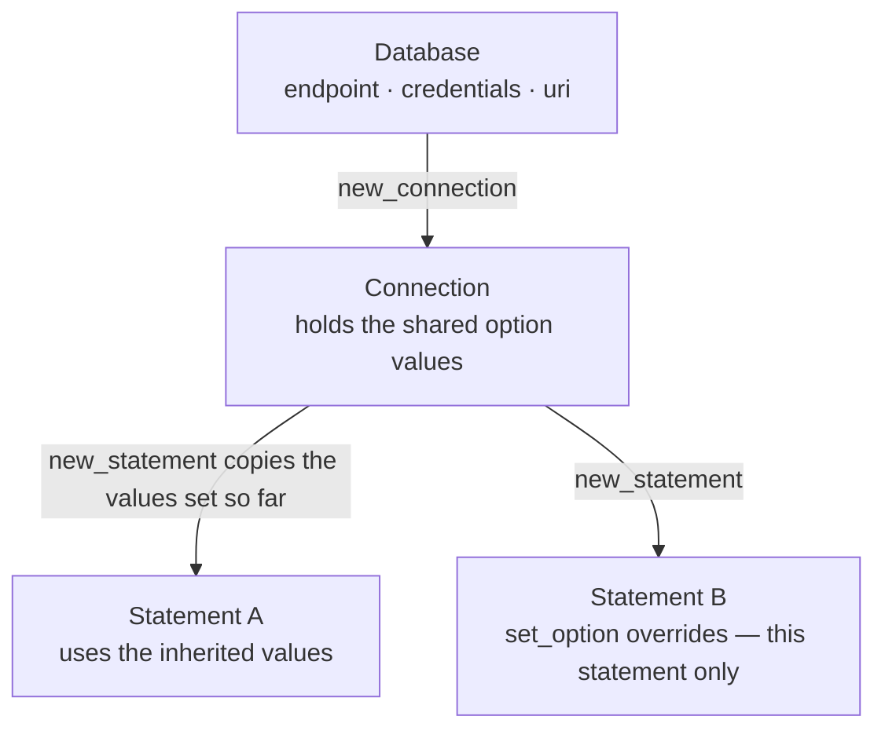
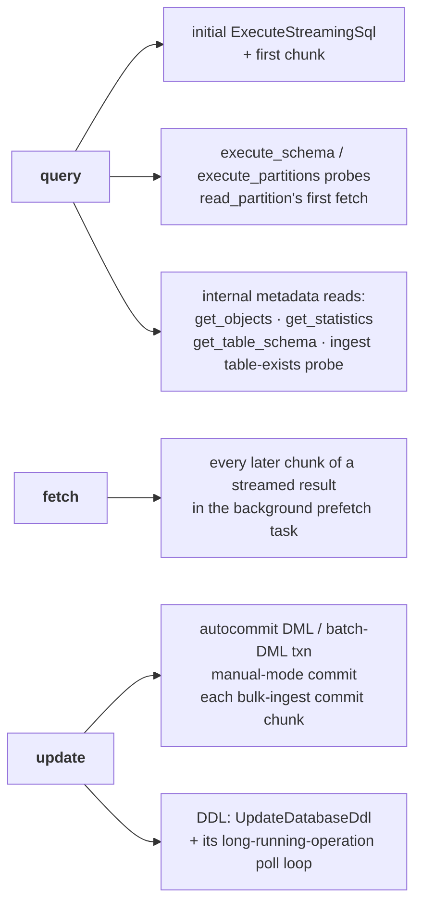

# Configuration options reference

The complete, authoritative list of every option the `adbc-spanner` driver supports, modeled on
the [BigQuery ADBC driver's options page](https://github.com/adbc-drivers/bigquery/blob/main/go/docs/bigquery.md).
Driver-specific options use the `spanner.*` prefix; the standard `adbc.*` (spec) options the driver
honours are listed with their spec meaning. Anything not listed here is rejected: setting an unknown
option fails with `NotImplemented`, reading one fails with `NotFound`.

Options are set through the standard ADBC surfaces: `set_option` on the object,
`new_database_with_opts` / `new_connection_with_opts`, the C driver manager's
`AdbcDatabaseSetOption` / `AdbcConnectionSetOption` / `AdbcStatementSetOption`, or `db_kwargs` /
`conn_kwargs` in the Python `adbc_driver_manager` bindings.

## Option levels

An option is set on one of the three ADBC objects, and each level answers a different question:

| Level | Object | What lives here |
| ----- | ------ | --------------- |
| [**Database**](#database-options) | `AdbcDatabase` | *Where* to connect and *as whom*: the database path, endpoint, credentials. Read once, when a connection is opened. |
| [**Connection**](#connection-only-options) | `AdbcConnection` | Session-wide behaviour: transactions, read-only mode, isolation. |
| [**Statement**](#statement-only-options) | `AdbcStatement` | Per-query/per-ingest behaviour: batch size, ingest target and mode. |

Most `spanner.*` tuning knobs — staleness, tags, timeouts, retry, … — exist at **both** the
connection and the statement level. Those are listed once, under
[Shared options](#shared-options-connection-and-statement).

### Inheritance: connection → statement

`new_statement()` **copies** the connection's shared option values as they stand at that moment. The
copy is then independent: setting the option on the statement overrides it for that statement only,
and a *later* change on the connection does not reach statements that already exist.



Two deliberate exceptions to the snapshot rule:

- **`adbc.connection.readonly` is live**, not copied — statements re-read it at execution time, so
  toggling it on the connection immediately affects statements that already exist.
- **`spanner.commit_stats.mutation_count` is per-object**, not inherited — each object reports the
  commits *it* performed, and a new statement starts with none recorded.

On a statement, `get_option` for a shared option always reports the **effective** value — the
inherited one unless this statement overrode it.

## Value coercion

All levels parse option values with the same shared rules (`src/options.rs`):

- **boolean** — exactly the string `true` or `false` (lowercase — the ADBC canonical spellings,
  matching the reference drivers; no other spellings, no case folding). Anything else — including
  an int-typed value (`SetOptionInt`) — fails with `InvalidArguments`.
- **positive integer** — an integer value or a numeric string; must be `> 0`.
- **non-negative seconds** — an integer value or a numeric string; must be `>= 0`.
- **string** — must be a string value; other value kinds fail with `InvalidArguments`.

Enumerated string values (modes, priorities, staleness prefixes, replica types, …) are matched
**exactly** in their canonical lowercase form — ADBC option values are exact-match constants across
the driver ecosystem, so e.g. `HIGH` or `MAX:1m` is rejected with `InvalidArguments` rather than
case-folded. (Free-form values such as tags are stored verbatim; surrounding whitespace of a value
is trimmed.)

The *Round-trips* column below says what `get_option` (the string form; `AdbcDatabaseGetOption`
etc.) returns for the option. Reading an option that is unset — and has no default to report —
fails with `NotFound`. The typed getters (`get_option_int` / `get_option_double`) reinterpret the
same stored string, so they serve any set option whose value parses as that type — e.g.
`spanner.rows_per_batch` and `spanner.retry.max_attempts` through `get_option_int`, and the
`spanner.rpc.timeout_seconds.*` options through `get_option_double` (integer-valued options are
served as doubles too) — and fail with `InvalidArguments` for options whose value does not.

## Database options

Set before connecting (a connection is established by `new_connection`; the database object only
holds configuration).

| Option | Type / allowed values | Default | Round-trips | Description |
| ------ | --------------------- | ------- | ----------- | ----------- |
| `uri` | string: a `spanner://` connection URI carrying the database path `projects/<p>/instances/<i>/databases/<d>` (see [Connection URIs](#connection-uris)) | — (required) | yes, when set (reports the expanded database path, not the original URI) | **Standard ADBC.** A `spanner://` connection URI whose path is the fully-qualified Spanner database path. A bare database path is **not** accepted — the scheme is required (matching the ADBC BigQuery driver's `bigquery://`). Connecting without it fails with `InvalidState`. |
| `spanner.endpoint` | string: gRPC endpoint URL, e.g. `http://localhost:9010` | unset (production Spanner service) | yes, when set | Explicit gRPC endpoint, e.g. a Spanner emulator. Takes precedence over the endpoint derived from `SPANNER_EMULATOR_HOST` (see [Environment](#environment)). |
| `spanner.emulator` | boolean | `false` (forced `true` when `SPANNER_EMULATOR_HOST` is set non-empty) | yes, always (`true`/`false`) | Connect with **anonymous credentials** (emulator mode). Combining emulator mode with explicitly configured credentials (`spanner.auth.keyfile`, `spanner.auth.keyfile_json`, `spanner.auth.impersonate.target_principal`, or `spanner.auth.access_token`) is refused at connect time with `InvalidState` instead of silently ignoring them; ambient ADC does not conflict. |
| `spanner.auth.keyfile` | string: path to a credential JSON file | unset (Application Default Credentials) | yes, when set | Path to a Google credential JSON key file (dbt's `keyfile`). The credential flow is auto-detected from the JSON's `"type"` field: `service_account`, `authorized_user`, `impersonated_service_account`, or `external_account`. Overridden by `spanner.auth.keyfile_json` if both are set. See [README § Authentication](../README.md#authentication). |
| `spanner.auth.keyfile_json` | string: inline credential JSON | unset (Application Default Credentials) | **no — write-only** (`get_option` always fails with `NotFound`, set or not: the value is a live private key and is never returned) | Inline Google credential JSON (dbt's `keyfile_json`); same auto-detection as `spanner.auth.keyfile`, and wins over it when both are set. Must be set as an option: it is **not** accepted as a `uri` query parameter (see [Connection URIs](#connection-uris)). |
| `spanner.auth.impersonate.target_principal` | string: service-account email | unset (no impersonation) | yes, when set | Setting this **enables service-account impersonation**: the base credentials (keyfile or ADC) mint a short-lived token for this target via the IAM Credentials `generateAccessToken` API, and the driver authenticates as the target. Follows gcloud's `--impersonate-service-account` / `google-cloud-auth`'s `impersonated` builder. See [README § Service-account impersonation](../README.md#service-account-impersonation). |
| `spanner.auth.impersonate.delegates` | string: comma-separated service-account emails | unset (no delegation chain) | yes, when non-empty (normalised: entries trimmed, empties dropped, re-joined with `,`) | Delegation chain for impersonation; each account must hold the *Token Creator* role on the next, the last on the target principal. Only used when a target principal is set. |
| `spanner.auth.impersonate.scopes` | string: comma-separated OAuth 2.0 scopes | unset (the `cloud-platform` scope) | yes, when non-empty (normalised as above) | Scopes for the impersonated token. Only used when a target principal is set. |
| `spanner.auth.impersonate.lifetime` | non-negative seconds | `3600` (one hour) | yes, when explicitly set (the implicit default is **not** reported) | Lifetime of the impersonated access token, in seconds. Only used when a target principal is set. |
| `spanner.auth.access_token` | string: OAuth 2.0 bearer token | unset (Application Default Credentials) | **no — write-only** (`get_option` always fails with `NotFound`, set or not: the value is a live bearer token and is never returned, matching `spanner.auth.keyfile_json`) | Authenticate with a caller-supplied OAuth 2.0 access token, sent verbatim as `Authorization: Bearer <token>` with **no refresh** (the caller owns token validity). A complete credential in its own right, so it is **mutually exclusive** with `spanner.auth.keyfile`, `spanner.auth.keyfile_json`, and `spanner.auth.impersonate.target_principal` — combining it with any of them is refused at connect time with `InvalidState`. Must be set as an option: it is **not** accepted as a `uri` query parameter (see [Connection URIs](#connection-uris)). See [README § OAuth access token](../README.md#oauth-access-token). |
| `spanner.auth.quota_project` | string: GCP project id | unset (the credential's own project) | yes, when set (`""` unsets) | The **quota / billing project** charged for API usage, decoupled from the project that owns the data — sent as the `x-goog-user-project` header. Attached to whichever credentials are in effect (ADC, keyfile, impersonation, or the access token), so it composes with every non-emulator credential path; the caller must hold `serviceusage.services.use` on it. Refused in emulator mode (which ignores it), like the credential options. Mirrors BigQuery's `bigquery.auth.quota_project` / gcloud's `--billing-project`. If `GOOGLE_CLOUD_QUOTA_PROJECT` is set, the auth library gives it precedence. See [README § Quota / billing project](../README.md#quota--billing-project). |

### Connection URIs

The `uri` option is a **connection URI** with the `spanner://` scheme (matched ASCII
case-insensitively). The scheme is **required** — a bare database path, or any other scheme such as
`cloudspanner:`, is rejected with `InvalidArguments` (this matches the ADBC BigQuery driver, whose
`uri` likewise requires the `bigquery://` scheme):

```text
spanner:///projects/<p>/instances/<i>/databases/<d>?spanner.endpoint=http://localhost:9010&spanner.emulator=true
spanner://localhost:9010/projects/<p>/instances/<i>/databases/<d>
```

The URI path is the database path; an optional `//host:port` authority becomes `spanner.endpoint`
(write `spanner:///projects/…`, with three slashes, when no endpoint host is intended). Query
parameters must be database-option names from the table above (unknown keys are rejected with
`InvalidArguments`); values are percent-decoded per RFC 3986 (`+` is a literal plus, not a space).

The two **secret-holding** options — `spanner.auth.keyfile_json` (a live private key) and
`spanner.auth.access_token` (a live bearer token) — are **not accepted as query parameters**: a URI
is the most-logged configuration artifact there is (shell history, process listings, connection
strings pasted into tickets, tracing spans), so a secret embedded in one leaks far beyond the
driver. Passing either in a URI fails with `InvalidArguments` naming the key; set it as a database
option instead. This matches their write-only `get_option` behaviour. `spanner.auth.keyfile` — a
*path*, not a secret — remains a perfectly good query parameter, and is the URI-friendly way to
point at a credential.

The URI is expanded into the individual options at the moment it is set, so precedence is
last-writer-wins per option: a later `set_option` overrides what the URI carried, and the URI
overwrites only the options it actually names. `get_option("uri")` reports the stored database
path, not the original URI.

## Connection-only options

These exist on the connection alone. (For the many options available on *both* the connection and
the statement, see [Shared options](#shared-options-connection-and-statement).)

| Option | Type / allowed values | Default | Round-trips | Description |
| ------ | --------------------- | ------- | ----------- | ----------- |
| `adbc.connection.autocommit` | boolean | `true` | yes, always (`true`/`false`) | **Standard ADBC.** `false` enters manual transaction mode — see [Manual transactions](#manual-transactions) below. Setting it back to `true` commits any buffered transaction (on failure the buffer is restored and the error returned). |
| `adbc.connection.readonly` | boolean | `false` | yes, always (`true`/`false`) | **Standard ADBC.** Reject all writes on this connection: DML, DDL and bulk ingest fail with `InvalidState`; queries still run. The commit paths are covered too — committing a manual transaction's buffered DML/ingest work, whether via `commit()` or by re-enabling `adbc.connection.autocommit`, fails with `InvalidState` and leaves the transaction open and replayable, while `rollback()` and committing a query transaction (neither writes) still work. The flag is **live**: statements read it at execution time, so toggling it immediately affects statements that already exist. |
| `adbc.connection.transaction.isolation_level` | one of `adbc.connection.transaction.isolation.default`, `…isolation.serializable`, `…isolation.repeatable_read`, `…isolation.snapshot` | `…isolation.default` (Spanner's default, `SERIALIZABLE`) | yes, always (the canonical spec string) | **Standard ADBC.** Isolation level for read/write transactions — see [Isolation levels](#isolation-levels) below. Statements inherit it but cannot set it. |
| `spanner.transaction.tag` | free-form string; `""` unsets | unset | yes, when set | Transaction tag attached to every read/write transaction the driver builds (autocommit DML, the manual-mode commit, ingest commits) and to the transactions a BatchWrite ingest creates. A tag describes a whole transaction, so — unlike `spanner.request.tag` — it has no statement-level counterpart; statements the connection creates still apply it to the transactions they build. |

Two standard connection options report the **current** catalog and schema: `adbc.connection.catalog`
and `adbc.connection.db_schema`. Both always report `""`, and neither can be pointed at anything
else — setting either to `""` is an accepted no-op (so generic clients that always set them keep
working), while any non-empty value fails with `NotImplemented`. A Spanner database has a single,
unnamed catalog, and although it supports named schemas (addressed by qualified name, e.g.
`sales.Orders`, and enumerated by `get_objects`) it has no settable session/current schema to select
one.

### Manual transactions

Setting `adbc.connection.autocommit=false` enters manual transaction mode. A transaction is exactly
**one kind of work**, fixed by its first statement:

- **Queries** — every query in the transaction shares one multi-use read-only snapshot, so they all
  see the same consistent point in time.
- **DML** — statements are *buffered* and applied atomically in one read/write transaction at
  `commit`. `execute_update` therefore returns an unknown row count until then, and a query inside a
  DML transaction fails with `InvalidState` (there is **no read-your-writes**).

Mixing the two kinds fails with `InvalidState`. `rollback` discards the buffered work / drops the
snapshot.

**DDL is not transaction-aware**: it always applies immediately, so it reorders ahead of buffered
DML and cannot be rolled back. See [README § Status](../README.md#status) for the full caveats.

### Isolation levels

`adbc.connection.transaction.isolation_level` applies to the **read/write transactions the driver
builds for DML** — autocommit DML, the `ExecuteBatchDml` batch, and the manual-mode commit of
buffered DML. It has **no effect on queries**: read-only transactions take a
[timestamp bound](#stale-reads) instead of an isolation level (Spanner rejects `REPEATABLE_READ` on
read-only and partitioned-DML transactions), and a mutations-only ingest commit uses the write-only
path, which has no isolation setting. Setting it on a connection that only runs queries is accepted
and inert.

| Spec level | Effect |
| ---------- | ------ |
| `default` | Sends no level; Spanner reads that as `SERIALIZABLE`. |
| `serializable` | Native `SERIALIZABLE`. |
| `repeatable_read` | Native `REPEATABLE_READ`. |
| `snapshot` | Native `REPEATABLE_READ` — Spanner implements repeatable read *as* snapshot isolation. |
| `read_uncommitted`, `read_committed` | **Promoted** to `repeatable_read`. |
| `linearizable` | **Promoted** to `serializable`. |

The three weaker/stronger spec levels are promoted upward to the weakest supported level that still
satisfies them, rather than rejected — this is spec-permitted and safe (a stronger level always
satisfies a weaker one's guarantees). `get_option` reports the **effective** level, so a promoted
value reads back as what it was promoted to. Unknown strings are rejected with `InvalidArguments`.

> **Write-skew caveat.** Under `repeatable_read` Spanner detects **write-write conflicts only**: a
> DML statement that reads rows it does not write (a subquery guard, a join, `INSERT … SELECT`) can
> commit on a stale snapshot and produce [write skew](https://cloud.google.com/spanner/docs/isolation-levels).
> This applies to a single autocommit statement, not just to multi-statement transactions.

## Shared options (connection and statement)

Every option below can be set on a **connection** and on a **statement**. A statement inherits the
connection's value at creation and may override it; `""` unsets (except where noted), and
`get_option` on a statement reports the effective value. See
[Inheritance](#inheritance-connection--statement) for the exact model.

| Option | Type / allowed values | Default | Round-trips | Description |
| ------ | --------------------- | ------- | ----------- | ----------- |
| `spanner.read.staleness` | `exact:<duration>`, `max:<duration>`, `read:<rfc3339>` or `min:<rfc3339>` (see [Stale reads](#stale-reads)) | unset (strong read) | yes, when set (the raw, trimmed value) | Read bound for read-only queries. Holds one bound at a time; a new value replaces the old. On a statement, `""` clears an inherited bound (forcing a strong read). |
| `spanner.max_timestamp_precision` | `nanoseconds_error_on_overflow` or `microseconds` (see [Timestamp precision](#timestamp-precision)) | `nanoseconds_error_on_overflow` | yes, always (the effective mode) | How `TIMESTAMP` columns map to Arrow: nanoseconds with a loud error outside ~1677–2262, or microseconds covering Spanner's full 0001–9999 range. Also governs `get_table_schema` and `read_partition`, which have no statement. Note `""` resets to the **driver** default, not to the connection's value. |
| `spanner.request.priority` | exactly `low`, `medium` or `high` (lowercase) | unset (service default, high) | yes, when set (the canonical lowercase form) | [Request priority](https://docs.cloud.google.com/spanner/docs/reference/rest/v1/RequestOptions) applied to every query/DML statement and `ExecuteBatchDml` batch the driver builds, to a BatchWrite ingest request, and — as the commit priority — to every read/write transaction. |
| `spanner.request.tag` | free-form string | unset | yes, when set | [Request tag](https://docs.cloud.google.com/spanner/docs/introspection/troubleshooting-with-tags) attached to every query/DML request and `ExecuteBatchDml` batch the driver builds (surfaced in query/transaction statistics). Not attached to a BatchWrite ingest, whose per-request tags Spanner ignores. Driver-internal metadata queries stay untagged. |
| `spanner.directed_read` | `include`/`exclude` replica selection (see [Directed reads](#directed-reads)) | unset (Spanner's own routing) | yes, when set (the raw, trimmed value) | [Directed read](https://docs.cloud.google.com/spanner/docs/directed-reads) replica selection applied to **read-only queries** (Spanner rejects it on writes). |
| `spanner.query.optimizer_version` | opaque version string, e.g. `"6"` or `"latest"` | unset (database/service default) | yes, when set (the raw value) | [Query optimizer version](https://docs.cloud.google.com/spanner/docs/query-optimizer/manage-query-optimizer), passed through as a `QueryOptions` on every query statement the driver builds. |
| `spanner.query.optimizer_statistics_package` | opaque statistics-package name | unset (database default) | yes, when set (the raw value) | [Optimizer statistics package](https://docs.cloud.google.com/spanner/docs/query-optimizer/statistics-packages), passed through the same way. |
| `spanner.commit.max_delay` | duration in `0..=500ms` (staleness grammar — default unit seconds, plus `s`/`ms`/`us`/`ns`/`m`/`h`; e.g. `100ms`, `0.2s`) | unset (no delay) | yes, when set (the raw, trimmed value) | [Maximum commit delay](https://docs.cloud.google.com/spanner/docs/reference/rest/v1/TransactionOptions) Spanner may add to a read/write commit so it can batch it with others (throughput-for-latency). Applied at the four commit sites: autocommit DML, the `ExecuteBatchDml` batch runner, the manual-mode commit, and the bulk-ingest write-only transaction. Values above 500ms (and malformed ones) are rejected with `InvalidArguments`. |
| `spanner.commit_stats` | boolean | `false` | yes, always (`true`/`false`) | Request [commit statistics](https://docs.cloud.google.com/spanner/docs/commit-statistics) on the read/write commits the driver builds (the same four sites as `spanner.commit.max_delay`). When enabled, the returned **mutation count** of the most recent commit is captured, and read back via `spanner.commit_stats.mutation_count` below. |
| `spanner.commit_stats.mutation_count` | **read-only** (setting it fails with `NotImplemented`) | `NotFound` until a commit with stats has run | via `get_option` / `get_option_int` | Mutation count from **this object's** most recent commit run with `spanner.commit_stats` enabled — the manual-mode commit on a connection; an autocommit DML or bulk-ingest commit on a statement (for a chunked ingest, the most recent chunk's). Per-object, so it is **not** inherited: a fresh statement reports `NotFound` regardless of the connection. |
| `spanner.rpc.timeout_seconds.query` | finite, non-negative seconds (fractions allowed); `0` disables (see [RPC timeouts](#rpc-timeouts)) | unset (no deadline) | yes, when set (also via `get_option_double`) | Overall deadline on a query's **initial execution**: the `ExecuteStreamingSql` call plus the first chunk of the streamed result, the `execute_schema` / `execute_partitions` probes, and `read_partition`'s initial fetch. Also bounds the driver-internal metadata **reads** (`get_objects`, `get_statistics`, `get_table_schema`, the ingest table-exists probe). Expiry fails with `Timeout`. |
| `spanner.rpc.timeout_seconds.update` | as `…query` | unset (no deadline) | yes, when set (also via `get_option_double`) | Overall deadline on each **write** operation: an autocommit DML / batch-DML transaction, the manual-mode commit, each bulk-ingest commit chunk, and a DDL change (the admin `UpdateDatabaseDdl` call **and** its long-running-operation poll loop). A commit whose confirmation the driver stopped waiting for may still have landed server-side — the usual ambiguity of any timed-out commit (a timed-out DDL likewise may already have applied). |
| `spanner.rpc.timeout_seconds.fetch` | as `…query` | unset (no deadline) | yes, when set (also via `get_option_double`) | Overall deadline on **each subsequent chunk fetch** of a streamed result (after the first, which `…query` covers), enforced inside the background prefetch task so a stalled stream fails the consumer's next batch with `Timeout`. |
| `spanner.retry.max_attempts` | positive integer (see [Retry tuning](#retry-tuning)) | unset (client default: uncapped on unary RPCs, 10 retries on queries) | yes, when set (also via `get_option_int`) | Cap on the number of attempts (first try + retries) the client makes for a retryable RPC; `1` disables retrying. Bounds the client's default retry policy without dropping its transport-error-on-idempotent retrying. **Exact on unary RPCs; permits one attempt too many on streaming queries** — see [What the two limits actually deliver](#what-the-two-limits-actually-deliver-per-rpc-path). |
| `spanner.retry.max_elapsed_seconds` | finite, strictly positive seconds (fractions allowed) | unset (client default, no cap) | yes, when set (also via `get_option_double`) | Cap on the total wall-clock time spent retrying a retryable RPC before the last error is surfaced. Combines with `spanner.retry.max_attempts` (whichever limit fires first wins). **Bounds unary RPCs only — inert on streaming queries**, which `spanner.rpc.timeout_seconds.query` bounds instead. |
| `spanner.retry.backoff.initial_seconds` | finite, strictly positive seconds (fractions allowed) | unset (client default, 1s) | yes, when set (also via `get_option_double`) | Initial delay of the client's exponential backoff between retry attempts. Setting any `spanner.retry.backoff.*` knob replaces the client's default backoff (unset knobs take the client defaults 1s / 60s / ×2, clamped to the gax recommended ranges). Independent of the attempt / elapsed-time caps. |
| `spanner.retry.backoff.max_seconds` | finite, strictly positive seconds (fractions allowed) | unset (client default, 60s) | yes, when set (also via `get_option_double`) | Ceiling the growing backoff delay is truncated at. Raised to the effective initial delay if set below it. |
| `spanner.retry.backoff.multiplier` | finite, strictly positive number | unset (client default, `2.0`) | yes, when set (also via `get_option_double`) | Per-attempt growth factor for the backoff delay. A value below `1.0` is floored to `1.0` (constant delay). |

## Statement-only options

| Option | Type / allowed values | Default | Round-trips | Description |
| ------ | --------------------- | ------- | ----------- | ----------- |
| `spanner.rows_per_batch` | positive integer | `8192` | yes, always (also via `get_option_int`) | Number of rows converted into each Arrow `RecordBatch` streamed by `execute`. Larger batches trade memory for fewer per-batch conversions; smaller batches lower first-batch latency and peak memory. |
| `spanner.data_boost` | boolean | `false` | yes, always (`true`/`false`) | Run `execute_partitions` partitions on [Data Boost](https://cloud.google.com/spanner/docs/databoost/databoost-overview) (Spanner's serverless, workload-isolated compute). Baked into every partition descriptor, so `read_partition` honours it on any connection. |
| `adbc.statement.bind_by_name` | boolean | `false` (positional) | yes, always (`true`/`false`) | How bound Arrow columns pair with the query's `@name` parameters, following the ADBC SQLite reference driver's `bind_by_name` convention ([apache/arrow-adbc#3362](https://github.com/apache/arrow-adbc/issues/3362)). **`false`** (the default): strictly positional — the *i*-th bound column binds to the *i*-th distinct parameter in query order, column names ignored (the ADBC ordinal contract positional clients and validation suites rely on). **`true`**: strict by-name — each column binds to `@<its own name>` (order-independent); a bound column that names no query parameter fails with `InvalidArguments` naming the missing parameter. See [README § Status](../README.md#status). |
| `adbc.statement.exec.incremental` | boolean; only `false` accepted | `false` | yes, always reports `false` | **Standard ADBC.** Incremental `execute_partitions` (returning partitions as they become available) is not implemented. The spec default `false` is accepted as a no-op — so generic clients that always set it keep working — while `true` fails with `NotImplemented`. |
| `adbc.ingest.target_table` | string: table name | unset | yes, when set | **Standard ADBC.** Bulk-ingest target table. Setting it clears any SQL query on the statement (query and ingest target are mutually exclusive on one handle). |
| `adbc.ingest.target_db_schema` | string: named schema (`""` = Spanner's default, unnamed schema) | unset (default schema) | yes, when set | **Standard ADBC.** Named schema qualifying the ingest target table. |
| `adbc.ingest.target_catalog` | `""` only | unset | yes, when set | **Standard ADBC.** Spanner has a single, unnamed catalog, so only the empty catalog is accepted; any other name fails with `NotImplemented`. |
| `adbc.ingest.temporary` | boolean; only `false` accepted | `false` | yes, always reports `false` | **Standard ADBC.** Spanner has no temporary tables. The spec default `false` is accepted as a no-op (so generic clients that always set it keep working); `true` fails with `NotImplemented`. |
| `adbc.ingest.mode` | `adbc.ingest.mode.append`, `adbc.ingest.mode.create`, `adbc.ingest.mode.create_append`, `adbc.ingest.mode.replace` (short forms `append` / `create` / `create_append` / `replace` also accepted) | `adbc.ingest.mode.create` (the ADBC spec default) | yes, always (the canonical `adbc.ingest.mode.*` form; unset reports the default, `adbc.ingest.mode.create`) | **Standard ADBC.** Bulk-ingest mode: `append` inserts into an existing table; `create` builds the table and errors if it already exists; `create_append` builds it only if absent; `replace` drops any existing table first. The three table-building modes derive the schema from the ingest data's Arrow schema and add a synthetic `adbc_ingest_key` UUID primary key (Spanner requires one) unless `spanner.ingest.primary_key` is set — see [README § Status](../README.md#status). |
| `spanner.ingest.primary_key` | comma-separated existing column names; `""` unsets | unset (synthetic `adbc_ingest_key` UUID key) | yes, when set (the comma-joined column list) | Primary key for the `create`/`create_append`/`replace` ingest modes. Unset, they add a synthetic `adbc_ingest_key` UUID key. Set to one or more **existing** ingest columns (in key order — this drives Spanner's physical row layout) to key on them instead, adding no synthetic column. A named column absent from the ingest data fails with `InvalidArguments`; Spanner separately rejects key columns of unsupported types (e.g. `FLOAT64`, `JSON`, `ARRAY`). Ignored by `append` (the existing table's key governs). |
| `spanner.ingest.batch_write` | boolean; `""` unsets | `false` (write-only transaction) | yes, always (`true`/`false`) | Route an **autocommit** bulk ingest's per-chunk mutations through Spanner's **BatchWrite** RPC instead of a write-only transaction — a non-atomic, higher-throughput ("firehose") transport. Insert semantics, chunking, the ingested-row count, the read-only-connection guard and the append-mode `NotFound`/`AlreadyExists` remap are all preserved; BatchWrite applies its mutation groups **non-atomically** (the same "not atomic as a whole" guarantee the multi-chunk write-only path already has). **Ignored** in manual-transaction mode (ingests buffer and commit atomically there). `spanner.request.priority` and `spanner.transaction.tag` apply on this path; `spanner.request.tag` does **not** (Spanner ignores per-request tags on BatchWrite), and neither do `spanner.commit.max_delay` / `spanner.commit_stats`, since BatchWrite takes no per-request commit options (so `spanner.commit_stats` reports no `mutation_count` for a BatchWrite ingest). |

## Stale reads

Read-only queries default to a **strong** bound — they see everything committed before they started.
`spanner.read.staleness` requests a stale read instead: reading slightly in the past is cheaper and
lock-free, which makes it ideal for analytics. Its value is one of four prefixed forms — two
*relative* (a duration) and two *absolute* (an RFC 3339 timestamp):

| Form | Meaning |
| ---- | ------- |
| `exact:<duration>` | Read exactly `<duration>` in the past — a single, repeatable timestamp. |
| `max:<duration>` | Read at any timestamp within `<duration>` of now; the server picks (bounded staleness — single-use reads only). |
| `read:<rfc3339>` (or a bare `<rfc3339>`) | Read exactly as of that timestamp. |
| `min:<rfc3339>` | Read at that timestamp or later; the server picks (bounded staleness — single-use reads only). |

`<duration>` is a non-negative number with an optional unit suffix: `s` (seconds, the default),
`ms`, `us`/`µs`, `ns`, `m` (minutes) or `h` (hours). Examples: `exact:10`, `exact:2.5s`,
`max:500ms`, `max:1m`, `read:2026-07-07T00:00:00Z`, `min:2026-07-07T00:00:00+02:00`.

The four prefixes are distinct, so a value is unambiguous; they are lowercase and matched exactly
(`MAX:1m` is rejected). The option holds one bound at a time; setting a new value replaces the old,
and `""` unsets it. Values are trimmed before parsing; malformed values fail with
`InvalidArguments`.

**Bounded staleness is pinned where it is illegal.** Spanner accepts the `max:` / `min:` kinds only
on *single-use* transactions. Contexts that need a multi-use read-only transaction — a bound
(parameterized) query over several parameter rows, and `execute_partitions` — therefore pin them to
their most-stale legal equivalent: `max:<d>` → exact staleness `<d>`, and `min:<t>` → read timestamp
`<t>`.

## Directed reads

[Directed reads](https://docs.cloud.google.com/spanner/docs/directed-reads) steer where a read-only
query is served — to (or away from) replicas in a given region and/or of a given type.
`spanner.directed_read` carries the selection as a small grammar:

```text
<mode> [ ":" <selection> ("," <selection>)* ] [ ";auto_failover_disabled" ]
```

- `<mode>` is exactly `include` or `exclude` (lowercase):
  - `include` — an **ordered preference** list; Spanner tries the selections in turn.
  - `exclude` — replicas Spanner routes **around**.
- Each `<selection>` is `<location>`, `<location>:<type>`, or `:<type>` (at least one of the two):
  - `<location>` is a region such as `us-east1`.
  - `<type>` is exactly `read_write`, `read_only` or `any` (lowercase). Omitted or `any` matches every
    replica type.
- The optional `;auto_failover_disabled` suffix — valid only with `include` — stops Spanner from
  falling back to a replica outside the list when the listed replicas are unavailable.

Examples:

- `include:us-east1` — prefer any replica in `us-east1`.
- `include:us-east1:read_only,us-east4:read_write` — prefer a read-only replica in `us-east1`, then a
  read-write replica in `us-east4`.
- `exclude:us-central1` — never route to replicas in `us-central1`.
- `include:us-east1;auto_failover_disabled` — prefer `us-east1` and do not fail over elsewhere.
- `include::read_only` — prefer any read-only replica, in any location.

Directed reads apply to **read-only queries only**: the driver attaches them to its query paths
(autocommit and manual mode, including parameterized/bound queries and `execute_partitions`) and
never to DML/DDL, which Spanner would reject. Values are trimmed before parsing; malformed values
fail with `InvalidArguments`.

## Timestamp precision

Spanner `TIMESTAMP` values span 0001-01-01 to 9999-12-31 at nanosecond precision. Arrow's
`Timestamp(Nanosecond)` stores an `i64` count of nanoseconds since the Unix epoch, which spans only
~1677-09-21 to 2262-04-11 — so the two ranges cannot both be honoured at nanosecond precision.
`spanner.max_timestamp_precision` picks how the driver resolves the mismatch:

- **`nanoseconds_error_on_overflow`** (the default) — `TIMESTAMP` maps to
  `Timestamp(Nanosecond, "UTC")`, preserving the full nanosecond precision Spanner delivers on the
  wire. Reading a well-formed instant outside the representable ~1677–2262 window is a **loud
  `InvalidArguments` error** naming the column, the offending value, and this option as the escape
  hatch.
- **`microseconds`** — `TIMESTAMP` maps to `Timestamp(Microsecond, "UTC")`, whose `i64` covers
  Spanner's **entire** 0001–9999 range (and far beyond). Any sub-microsecond digits a value carries
  are **truncated toward negative infinity** (a floor on the timeline, also for pre-epoch instants:
  `…56.789012345Z` → `…56.789012`, and one nanosecond *before* the epoch becomes microsecond `-1`,
  not `0`). This is lossy for values with real nanosecond precision — that loss is the price of the
  full range.

Exactly these two values exist **by design**. A third mode that keeps nanoseconds and silently
wraps or clamps out-of-range values (as some drivers offer under a plain `nanoseconds` value) is
deliberately not offered: a wrapped timestamp is a plausible-looking, wrong instant —
indistinguishable from real data, i.e. silent corruption. Every supported mode is either lossless
or explicit about what it loses (documented microsecond truncation), and anything else fails
loudly. The option is modeled on the Snowflake ADBC driver's `max_timestamp_precision`
([apache/arrow-adbc#2917](https://github.com/apache/arrow-adbc/issues/2917)), minus its
silent-wraparound value.

The selected mode applies uniformly to **every** surface that produces timestamp data or
timestamp-typed schemas: `execute` (plain, parameterized and multi-row bound queries, including
the streamed batches after the first), DML `THEN RETURN` rows, `execute_schema` (the PLAN probe)
and the `execute_partitions` schema — so the advertised schema always carries the same unit as the
data — plus `get_table_schema` and `read_partition` at the connection level. `read_partition`
decodes under the **reading** connection's mode: set it to the same value as the producing
statement so the descriptor's schema matches what is streamed.

Setting `""` resets to the driver default (`nanoseconds_error_on_overflow`) — note this is the one
shared option where `""` does *not* fall back to the connection's value. `get_option` always reports
the effective mode. The **bind** (write) direction is unaffected: Arrow timestamp parameters of any
unit (`Second`/`Millisecond`/`Microsecond`/`Nanosecond`) are always accepted and bound at their full
source precision.

## RPC timeouts

Without a deadline, a hung RPC blocks the (synchronous) ADBC call indefinitely, with `cancel` as
the only escape. The `spanner.rpc.timeout_seconds.{query,update,fetch}` options — named in parallel
with the Flight SQL ADBC driver's `adbc.flight.sql.rpc.timeout_seconds.*` family — bound the
driver's Spanner-facing operations. Each of the driver's network paths falls under exactly one of
the three:



- **`query`** — the *initial execution* of a query, and every driver-internal metadata read (each is
  itself a query).
- **`fetch`** — *each subsequent chunk fetch* of a streamed result, so a stream that stalls
  mid-result fails the consumer's next batch instead of hanging. For a bound (parameterized) query
  over several rows it also covers executing each per-row statement as the stream advances.
- **`update`** — each *write* operation, including the commit performed when autocommit is
  re-enabled, and DDL — whose LRO poll loop would otherwise be the driver's most dangerous unbounded
  path.

Each value is a number of **seconds**, parsed as a double (fractions allowed) from a numeric
string, integer or double value; it must be finite and non-negative — `NaN`, the infinities and
negatives fail with `InvalidArguments`. `0` disables the timeout (same as unset, but it still
round-trips); an empty string (`""`) unsets. All three round-trip through `get_option` and
`get_option_double`.

Enforcement is an **overall deadline per operation** (a `tokio::time::timeout` around the whole
driver-side operation, including any retries the client performs inside it), not a per-attempt
gRPC timeout. An expired deadline fails with ADBC `Timeout` status. Note that a timed-out *commit*
may still have landed server-side — the usual ambiguity of any commit whose confirmation was not
awaited — and a timed-out DDL change may likewise have already applied (its poll simply stopped
being awaited). Unlike the request-tag/priority options, which leave the driver-internal metadata
queries untagged, these timeouts *do* bound them, so no driver-side network path is left able to
hang unboundedly.

## Retry tuning

Every data-plane RPC the driver issues is retried by the Spanner client under a default policy —
strict [AIP-194](https://google.aip.dev/194), additionally retrying transport / IO errors on
idempotent requests (which all the driver's data-plane RPCs are). On the unary RPC paths that default
has **no** attempt or elapsed-time cap, so a persistently `UNAVAILABLE` backend is retried until the
operation-wide [RPC timeout](#rpc-timeouts) (if any) fires. The `spanner.retry.*` options let you
*bound* that retrying instead, mirroring the gax `RetryPolicyExt` / `ExponentialBackoffBuilder`
knobs. They come in two independent families:

**How many times / for how long** — either may be set alone; the retry loop stops at whichever limit
is reached first:

- **`spanner.retry.max_attempts`** — the maximum number of attempts, the first try plus retries, as
  a positive integer (accepted as an integer, a whole-valued double, or a numeric string). `1`
  disables retrying. Round-trips through `get_option` and `get_option_int`.
- **`spanner.retry.max_elapsed_seconds`** — an upper bound, in seconds, on the total wall-clock time
  spent across attempts before the last error is surfaced as permanent. A finite, strictly positive
  number (fractions allowed), accepted from a numeric string, integer or double. Round-trips through
  `get_option` and `get_option_double`.

Zero, negative, non-finite and (for attempts) fractional or above-`u32::MAX` values fail with
`InvalidArguments`; an empty string (`""`) unsets.

**How long to wait between attempts** — the client's truncated exponential backoff with jitter:

- **`spanner.retry.backoff.initial_seconds`** — the first inter-attempt delay, in seconds (client
  default 1s).
- **`spanner.retry.backoff.max_seconds`** — the ceiling the growing delay is truncated at, in seconds
  (client default 60s); raised to the effective initial delay if set below it.
- **`spanner.retry.backoff.multiplier`** — the per-attempt growth factor (client default `2.0`); a
  value below `1.0` is floored to `1.0` (a constant delay).

Setting **any** of the three replaces the client's default backoff with an exponential backoff whose
unset knobs take the client defaults, with the whole combination clamped to the gax recommended
ranges (initial delay ≥ 1ms, maximum delay in `[1s, 24h]`, multiplier in `[1.0, 32.0]`) so it can
never fail to build. Each is a finite, strictly positive number accepted from a numeric string,
integer or double, round-trips through `get_option` / `get_option_double`, and an empty string
unsets it. The two families are **orthogonal** — either may be set on its own.

When **nothing** is set the client keeps its own default policy, so the feature is purely opt-in and
by default changes nothing. When anything is set, the driver applies a bounded policy that still
retries transport / IO errors on idempotent requests exactly like the client's default — the limits
are layered on top rather than replacing that behaviour — to every user query/DML statement, the
read/write transaction runner's begin+commit RPCs, the bulk-ingest write-only transaction, and the
`ExecuteBatchDml` batch. This tunes the *per-attempt* retry loop; the [RPC timeout](#rpc-timeouts)
family bounds the *overall* per-operation wall time — the two are complementary. The
transaction-level abort retry (Spanner's optimistic-concurrency re-run on `ABORTED`) is a separate
policy and stays at the client default.

### What the two limits actually deliver, per RPC path

The Spanner client runs **two different retry loops**, and they count attempts differently — so both
limits land differently depending on which RPC carries the work. This is an upstream defect that the
driver cannot correct (the same policy object feeds both loops, and they would need *different*
limits to deliver the same guarantee), so it is documented rather than compensated:

| | Unary RPCs — DML, `ExecuteBatchDml`, begin, commit | Streaming queries — `ExecuteStreamingSql` |
| --- | --- | --- |
| `spanner.retry.max_attempts = N` | exactly `N` attempts; `1` disables retrying | **`N + 1`** attempts; `1` does **not** disable retrying |
| `spanner.retry.max_elapsed_seconds` | bounds the loop as documented | **inert** — never fires |
| client default when unset | uncapped | capped at 10 retries (11 attempts, per the row above) |

The cause is that the streaming query path is dispatched outside gax's retry loop and hand-rolls its
stream resumption, seeding the retry policy with the count of *retries so far* (`0` on the first
failure, hence the off-by-one) and a freshly-taken start instant (hence the never-firing elapsed
budget). If you need a wall-clock bound on a **query**, use the [RPC timeout](#rpc-timeouts) family
(`spanner.rpc.timeout_seconds.query` / `…fetch`) — it does bound that path. The exact numbers above
are pinned by tests (`retry_max_attempts_*` / `retry_max_elapsed_seconds_*` in
`tests/mock_spanner.rs`).

## Environment

- **`SPANNER_EMULATOR_HOST`** — read at connect time. When set non-empty, it supplies the gRPC
  endpoint (unless `spanner.endpoint` was set explicitly, which wins) and forces emulator mode —
  exactly as if `spanner.emulator=true`: anonymous credentials, and explicitly configured
  credential options are refused with `InvalidState` (a stray emulator variable must not silently
  redirect authenticated traffic). A bare `host:port` value gets an `http://` scheme prefixed.
  Note the emulator's gRPC port must be `9010`: the underlying client derives the admin REST
  endpoint by replacing `9010` with `9020` in the endpoint, and DDL goes through the admin API.
- **Application Default Credentials** — when no keyfile or `spanner.auth.access_token` option is set
  (and not in emulator mode), the driver falls back to standard
  [ADC](https://cloud.google.com/docs/authentication/application-default-credentials)
  resolution, which honours `GOOGLE_APPLICATION_CREDENTIALS`, `gcloud auth application-default
  login`, or the metadata server. See [README § Authentication](../README.md#authentication).
- **`GOOGLE_CLOUD_QUOTA_PROJECT`** — read by the auth library, and takes precedence over the
  `spanner.auth.quota_project` option.
