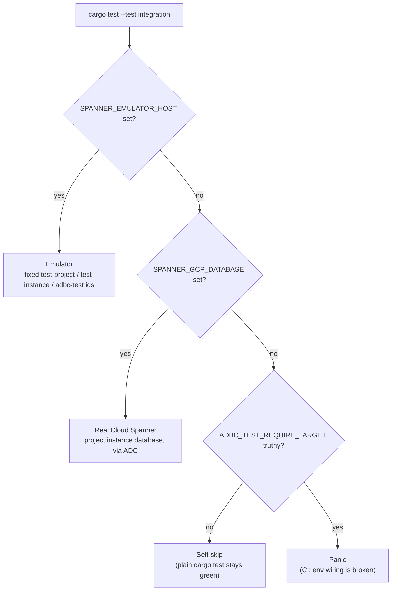

# Testing overview

This is the single map of how `adbc-spanner` is tested: what each kind of test covers, how to run it
locally, which CI workflow runs it, and where the detailed, co-located documentation lives. The
detailed reference material stays next to the code it tracks (so it does not drift); this page just
links out to it.

Every emulator- or credential-gated suite **self-skips** when its target environment variable is
unset, so a plain `cargo test` is green everywhere with no external dependencies. (In CI that
silence would be dangerous — a dropped env var would turn a whole suite green with zero coverage —
so every CI job that needs a target also sets `ADBC_TEST_REQUIRE_TARGET=1`, which flips the skip
into a loud failure. Do not set it locally.)

| Kind | Local command | CI workflow | Detail doc |
| --- | --- | --- | --- |
| Unit tests + doctests | `cargo test` | [`ci.yml`](../.github/workflows/ci.yml) | — |
| Emulator integration | `scripts/with-emulator.sh cargo test` | [`ci.yml`](../.github/workflows/ci.yml) | — |
| Real Cloud Spanner | `SPANNER_GCP_DATABASE=… cargo test --test integration` | — (local only) | — |
| Python package | `pytest python/tests` (needs an emulator) | [`ci.yml`](../.github/workflows/ci.yml) | [`python/README.md`](../python/README.md) |
| Resilience / fault injection | `scripts/with-toxiproxy.sh cargo test --test resilience` | [`resilience.yml`](../.github/workflows/resilience.yml) | [`tests/RESILIENCE.md`](../tests/RESILIENCE.md) |
| ADBC C++ validation | `scripts/run-adbc-validation.sh` | [`adbc-validation.yml`](../.github/workflows/adbc-validation.yml) | [`adbc-validation/README.md`](../adbc-validation/README.md) |
| Foundry differential oracle | `scripts/run-foundry-validation.sh` | [`foundry-validation.yml`](../.github/workflows/foundry-validation.yml) | [`foundry-validation/README.md`](../foundry-validation/README.md) |
| Fuzzing | `cargo +nightly fuzz run <target>` | [`fuzz.yml`](../.github/workflows/fuzz.yml) | — |
| Benchmarks | `cargo bench` | — | — |

## Unit tests and doctests

The unit tests and rustdoc doctests exercise the pure-Rust logic that needs no network — SQL
statement splitting / DDL detection, the `DATE`/`TIMESTAMP`/`NUMERIC` value parsers, staleness and
directed-read grammars, option parsing, and the Arrow conversion helpers. They also include the
in-process **mock gRPC server** suite ([`tests/mock_spanner.rs`](../tests/mock_spanner.rs)), which
scripts a `google.spanner.v1.Spanner` server (the pinned client's `spanner-grpc-mock` crate) to
return exact gRPC statuses (`ABORTED` + `RetryInfo`, mid-stream `UNAVAILABLE`, a stream that goes
silent) and asserts the driver maps them correctly — logical faults an L4 proxy cannot produce.

All of it is offline and deterministic, so it needs no emulator:

```sh
cargo test                        # unit tests + doctests; emulator/credential suites self-skip
cargo test --test mock_spanner    # just the mock gRPC server suite
```

Runs on every push and pull request in [`ci.yml`](../.github/workflows/ci.yml), alongside
`cargo fmt --check`, `clippy -D warnings`, `cargo doc` (warnings denied, so broken rustdoc links
fail CI), a `--no-default-features` build, `actionlint` over the workflow files, and supply-chain
checks (`cargo-deny` + `cargo-machete`).

## How a test run picks its target

`tests/integration.rs` resolves its target from the environment — the emulator wins if both
variables are set:



## Emulator integration tests

[`tests/integration.rs`](../tests/integration.rs) runs the whole driver end-to-end against a local
[Cloud Spanner emulator](https://cloud.google.com/spanner/docs/emulator): schema setup via the admin
clients, DML insert, typed `SELECT`, partitioned execution, and an **FFI smoke test** that loads the
built cdylib through the ADBC driver manager (the `AdbcSpannerInit` C entrypoint) and runs a query.
It is gated on `SPANNER_EMULATOR_HOST` and self-skips when unset.

```sh
scripts/with-emulator.sh cargo test          # runs the emulator in Docker, then tears it down
```

`scripts/with-emulator.sh` starts the emulator in Docker, waits for the **admin API** to actually
answer (a REST 200, not just an open TCP port — the forwarded port accepts connections ~1s before the
emulator serves, and starting that early makes schema setup fail with a confusing "Instance not
found"), exports `SPANNER_EMULATOR_HOST`, runs the command, then tears the emulator down. Docker is
required.

> **The gRPC port must be `9010`.** The pinned client derives the admin/REST endpoint by
> literal-substring-replacing `9010`→`9020` in the gRPC endpoint, so on any other port the admin
> requests go to the gRPC port and **every DDL / `create_database` call fails**. The *host* is free;
> the port is not, and the driver has no override. To run several emulators at once (e.g. parallel
> worktrees), give each container no published port and connect via its docker-network IP on the
> internal `9010`/`9020`.

In [`ci.yml`](../.github/workflows/ci.yml) the emulator runs as a service container and the
integration suite runs against it on every push and PR.

## Real Cloud Spanner tests

The same [`tests/integration.rs`](../tests/integration.rs) suite can run against a **real** Cloud
Spanner database instead of the emulator, reached with Application Default Credentials. This is the
only path that exercises the non-emulator ADC auth flow.

```sh
SPANNER_GCP_DATABASE=my-project.my-instance.my-db cargo test --test integration -- --nocapture
```

The target is `project.instance.database`; the instance must already exist, and the test
best-effort creates the database and its scratch tables and cleans up after itself.

**Opt-in auth end-to-end tests** (the `auth_end_to_end` module) additionally exercise the
`spanner.auth.keyfile` and `spanner.auth.impersonate.target_principal` credential paths against a real database
(the emulator refuses these credentials). They self-skip unless `SPANNER_GCP_DATABASE` plus
`SPANNER_TEST_KEYFILE` and/or `SPANNER_TEST_IMPERSONATE_TARGET_PRINCIPAL` are set.

This suite is **run locally only** — no CI job exercises a real Cloud Spanner database. The canonical
functional suites (`ci.yml` / `adbc-validation.yml`) run entirely against the emulator, so the
non-emulator ADC auth path is covered by running the command above by hand against a real target.

## Python package tests

[`python/tests`](../python/tests) exercises the `adbc-driver-spanner` wheel the way a real user
would: it loads the built cdylib through `adbc_driver_manager` and drives the DBAPI/Arrow surface —
DDL, DML, bulk ingest, manual transactions, options, the DataFrame paths (pandas / polars / duckdb),
the README cookbook snippets, and a **differential oracle** (`test_differential_oracle.py`) that
checks the driver's type mapping against Google's own `google-cloud-spanner` client. Gated on
`SPANNER_EMULATOR_HOST`; self-skips when unset.

```sh
cargo build
cp target/debug/libadbc_spanner.so python/adbc_driver_spanner/   # what the wheel job does
pip install ./python pyarrow pandas polars duckdb pytest google-cloud-spanner
scripts/with-emulator.sh python -m pytest python/tests -v
```

[`ci.yml`](../.github/workflows/ci.yml) runs this as a **gating** job on every push and PR, against
both ends of the supported Python range (3.11 and the latest 3.x). `SPANNER_EMULATOR_REST_PORT`
overrides the REST admin port for the test fixtures (it is read by `conftest.py`, not the driver).

## Resilience / fault injection

[`tests/resilience.rs`](../tests/resilience.rs) drives the driver against the emulator **through a
[Toxiproxy](https://github.com/Shopify/toxiproxy) TCP proxy** and injects transport-level faults —
bandwidth throttles, TCP resets, orderly mid-stream closes — asserting the driver cancels, surfaces
clean errors, recovers, and never loses a buffered write or silently truncates a stream. It self-skips
unless `TOXIPROXY_URL` + `SPANNER_EMULATOR_HOST` are set.

```sh
cargo build
scripts/with-toxiproxy.sh cargo test --test resilience -- --nocapture --test-threads=1
```

Run serially (`--test-threads=1`): the tests share one global proxy. Docker is required.
[`resilience.yml`](../.github/workflows/resilience.yml) runs it **non-gating** (manual dispatch +
nightly). Toxiproxy injects transport faults only; the logical-gRPC-fault complement lives in the
`tests/mock_spanner.rs` suite (see [Unit tests](#unit-tests-and-doctests) above).

See [`tests/RESILIENCE.md`](../tests/RESILIENCE.md) for the full list of injected toxics, what each
test proves, and the honest limitations of transport-level fault injection.

## ADBC C++ validation suite

[`adbc-validation/`](../adbc-validation/) runs the canonical Apache Arrow ADBC validation suite — the
driver-agnostic conformance battery the in-tree ADBC drivers (SQLite, PostgreSQL, …) use — against
the built `libadbc_spanner` cdylib over its **C ABI**, complementing the Rust trait-level integration
tests.

```sh
scripts/run-adbc-validation.sh              # throwaway emulator, the gated CI subset
scripts/run-adbc-validation.sh --full       # every case (local exploration)
scripts/run-adbc-validation.sh --check-drift  # build + stale-allowlist guard only (no database)
ADBC_VALIDATION_SANITIZE=address,undefined scripts/run-adbc-validation.sh  # + C-side ASan/UBSan
ADBC_VALIDATION_SANITIZE=address ADBC_VALIDATION_RUST_SANITIZE=address \
  scripts/run-adbc-validation.sh            # + the cdylib itself, ASan-instrumented (nightly)
```

The script builds the cdylib and a C++ harness (needs a C++17 compiler, CMake ≥ 3.20 and git) and
runs the suite. [`adbc-validation.yml`](../.github/workflows/adbc-validation.yml) runs the gated
subset as a **gating** CI job, in three legs: `plain`; `asan-ubsan` (the C++ side built with
`-fsanitize=address,undefined`, driving the uninstrumented cdylib — its `malloc`/`free`/`memcpy`
interceptors catch memory bugs on the C-ABI structs at the FFI boundary); and `rust-asan` (the
**cdylib itself** built with nightly `-Zsanitizer=address` + `-Zbuild-std`, driven by a clang
`-fsanitize=address` C++ side so both share one compiler-rt ASan runtime — catching memory bugs
*inside* Rust that never reach a C-side interceptor). The `rust-asan` leg carries a **cross-boundary
ASan canary**: before the suite runs it builds the cdylib with `--cfg asan_canary` (a test-only
intentionally-out-of-bounds symbol, absent from every normal build) and calls it from a clang
`-fsanitize=address` program against a C++-allocated buffer, asserting ASan reports the
`heap-buffer-overflow` — so a silently-disarmed instrumentation makes the leg go red instead of
passing as a no-op. See the validation README's *Sanitizers* section.

See [`adbc-validation/README.md`](../adbc-validation/README.md) for the exact gated allowlist, what
each case covers, and the follow-up work on the remaining `StatementTest` cases.

## Foundry differential-oracle validation

[`foundry-validation/`](../foundry-validation/) runs the **ADBC Driver Foundry** validation suite (a
type/feature coverage matrix) against the cdylib through the ADBC driver manager — a Python harness
that loads the driver and runs a corpus of declarative query cases with Spanner-dialect overrides. It
is complementary to the C++ conformance suite above.

```sh
scripts/run-foundry-validation.sh           # throwaway emulator, runs the suite
scripts/run-foundry-validation.sh -k ingest # extra args are forwarded to pytest
```

The script builds the driver, installs the pinned validation package, bootstraps the emulator, and
runs pytest. [`foundry-validation.yml`](../.github/workflows/foundry-validation.yml) runs it as a
**gating** CI job on pushes to main and PRs: every case passes or skips with a reason — no expected
failures.

See [`foundry-validation/README.md`](../foundry-validation/README.md) for the per-category status and
the Spanner-specific adaptations.

## Fuzzing

The [`fuzz/`](../fuzz/) crate has [`cargo-fuzz`](https://github.com/rust-fuzz/cargo-fuzz) targets over
the parts that parse untrusted strings, asserting the absence of panics (and, for `like`, no
exponential blowup). Each is a `libfuzzer-sys` harness over the `fuzzing` feature module in
`src/lib.rs`. The ten targets:

| Target | Covers |
| --- | --- |
| `sql` | statement splitting / DDL detection |
| `values` | the `DATE`/`TIMESTAMP`/`NUMERIC` parsers |
| `like` | the `LIKE` matcher |
| `keyword` | keyword classification |
| `options` | option key/value parsing |
| `params` | parameter extraction |
| `partition` | partition-descriptor decoding |
| `staleness` | `spanner.read.staleness` + the shared duration grammar |
| `directed_read` | `spanner.directed_read` |
| `uri` | the `spanner:` connection URI |

```sh
cargo +nightly fuzz run sql                 # run one target locally (needs nightly)
```

`fuzz/` is a **member of the root workspace**, so there is one `Cargo.lock` for the whole repo and
`cargo fuzz` builds into the root `target/`. `default-members = ["."]` keeps it out of the default
build scope, so plain `cargo build`/`test`/`clippy` never touch it and never need nightly.

[`fuzz.yml`](../.github/workflows/fuzz.yml) fuzzes targets nightly (and on demand), seeding from the
committed [`fuzz/seeds/`](../fuzz/seeds) corpus and caching the generated corpus between runs so
coverage accumulates. Note its matrix currently lists only the first seven targets — `staleness`,
`directed_read` and `uri` are **not yet fuzzed in CI** and must be run by hand until the matrix
catches up.

## Benchmarks

[Criterion](https://github.com/bheisler/criterion.rs) benchmarks in
[`benches/conversion.rs`](../benches/conversion.rs) cover the hottest path — decoding Spanner wire
values into Arrow arrays (`src/conversion.rs`). They run entirely offline against synthetic values
(no network or emulator), one default-size streaming chunk (8192 rows) per benchmark.

```sh
cargo bench                 # full measurement
cargo bench -- --test       # fast single-pass sanity run
```
