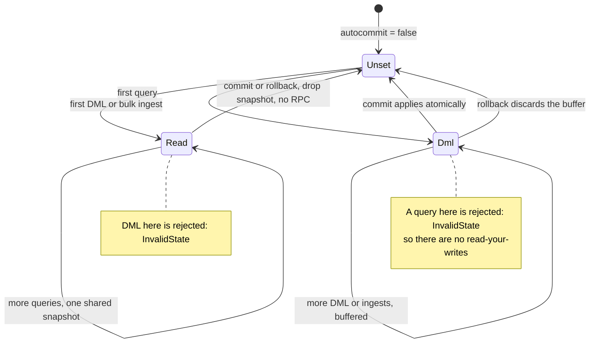
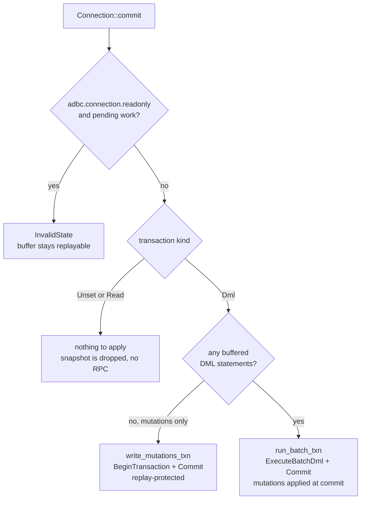

# Spanner transactions and the gRPC calls this driver makes

This document describes Spanner's transaction model, shows how `adbc-spanner` maps ADBC's
transaction API onto it, and enumerates the gRPC calls that read or write data — for each, how it
interacts with transactions, how much work it can carry in one round-trip, and where (or whether)
the driver uses it.

It is a *reference for the driver's behaviour*, not a Spanner tutorial. For the option surface see
[docs/options.md](options.md); for the ADBC-level view see [docs/adbc.md](adbc.md).

**Ground truth.** Driver code is cited by **file and symbol** (`src/connection.rs`
`apply_isolation`) rather than by line number, so a citation stays valid as the code moves and can
be found with a grep. Client behaviour is cited against the pinned `google-cloud-spanner` preview
client (see [CLAUDE.md](../CLAUDE.md) for the pin) as `<client>/src/file.rs:line` — line numbers are
stable there because the pin is a fixed revision. Published Spanner limits are cited to
[Quotas & limits](https://docs.cloud.google.com/spanner/quotas); where a limit is *not* published,
this document says so rather than inventing a number.

## 1. Spanner's transaction model

Spanner is externally consistent: every read and write is stamped with a **TrueTime** commit
timestamp, and the ordering of those timestamps matches real time. That single property is what the
transaction modes below are built on.

**Locking read-write.** The only mode that can write. `SERIALIZABLE` by default (`REPEATABLE_READ` is
also selectable — Spanner implements it as snapshot isolation). It must be committed, and it may be
**aborted** by the server at any time — contention, deadlock avoidance, schema change. An aborted
transaction is not a failure the application must surface; the contract is that the client **replays
the whole transaction body** on `ABORTED`. That is why the client library takes a *closure* rather
than handing out a begin/commit handle: the closure is what it re-runs. The `ABORTED` error carries a
`RetryInfo` with a `retryDelay` the runner consumes for its backoff.

**Lock mode, and the isolation level that silently picks one.** A read-write transaction also carries
a `read_lock_mode` (`TransactionOptions.ReadWrite.read_lock_mode`), which decides *when* a conflict is
resolved:

- `PESSIMISTIC` — under `SERIALIZABLE`, *"reads and writes acquire necessary locks during transaction
  statement execution"*. A conflict blocks at the conflicting statement.
- `OPTIMISTIC` — at either isolation level, *"reads and writes do not acquire locks during transaction
  statement execution"*. Nothing blocks; instead the commit is validated and `ABORTED` if anything the
  transaction read has changed since.

Pessimistic pays in lock contention and blocking; optimistic pays in wasted work, since a long
transaction can do everything and only then abort at commit.

The part worth knowing is that the **default is derived from the isolation level** rather than being a
fixed value (`<client>/src/generated/gapic_dataplane/model.rs:9644`):

> * If isolation level is `SERIALIZABLE`, locking semantics default to `PESSIMISTIC`.
> * If isolation level is `REPEATABLE_READ`, locking semantics default to `OPTIMISTIC`.

This driver never sets `read_lock_mode` — it appears nowhere in `src/` — so every read-write
transaction gets the isolation-derived default. Composed with the
`adbc.connection.transaction.isolation_level` mapping (`src/connection.rs`
`parse_isolation_level` / `apply_isolation`), the effective lock mode is:

| Option value | Level sent to Spanner | Effective lock mode |
| --- | --- | --- |
| `default` | none — Spanner reads this as `SERIALIZABLE` | pessimistic |
| `serializable` | `SERIALIZABLE` | pessimistic |
| `linearizable` (promoted) | `SERIALIZABLE` | pessimistic |
| `repeatable_read` | `REPEATABLE_READ` | **optimistic** |
| `snapshot` | `REPEATABLE_READ` | **optimistic** |
| `read_committed` (promoted) | `REPEATABLE_READ` | **optimistic** |
| `read_uncommitted` (promoted) | `REPEATABLE_READ` | **optimistic** |

`snapshot` is a **native match, not a promotion**: Spanner implements `REPEATABLE_READ` *as* snapshot
isolation, and the two definitions are near-verbatim identical. The levels Spanner does not expose are
**promoted upward** to the weakest supported level that still satisfies them — never downgraded — so
the driver always delivers at least what was asked. An unknown level string is rejected with
`InvalidArguments`. `default` sends no level at all; there is no database- or client-level isolation
default to inherit, so Spanner's own `SERIALIZABLE` applies.

So choosing a *weaker* isolation level here does not merely relax the isolation guarantee — it also
flips the concurrency-control strategy, trading execution-time blocking for commit-time aborts. Under
write contention that can mean *more* aborts, which is the opposite of what someone reaching for a
weaker level usually expects. The client does expose `TransactionRunnerBuilder::set_read_lock_mode`
(`<client>/src/transaction_runner.rs:276`) beside the `set_isolation_level` the driver already calls
(`:253`), so decoupling the two is possible; the driver currently does not.

**Read-only / snapshot.** Reads at a **timestamp bound** with no locks, and therefore never blocks
writers, is never aborted, and needs no commit. The bound is either *strong* (read at now — the
default) or *stale*: exact staleness, bounded staleness, or an explicit read timestamp. Stale reads
are cheaper and can be served by any sufficiently-caught-up replica. Bounded-staleness bounds
(`max_staleness` / `min_read_timestamp`) are **single-use only** — Spanner rejects them on a
multi-use read-only transaction, because a multi-use transaction must pin one repeatable timestamp
and a bounded kind lets the server pick one per read.

**Isolation level does not apply to read-only transactions**, and neither does `read_lock_mode`. A
read-only transaction takes no locks and can never conflict, so there is nothing to isolate it
against: what it observes is fixed entirely by its **timestamp bound**, which is the read-only
analogue of an isolation knob. The proto states the exclusion outright — `REPEATABLE_READ` *"does not
support read-only and partitioned DML transactions"*
(`<client>/src/generated/gapic_dataplane/model.rs:10165`) — and an unspecified level means
`SERIALIZABLE` (`:10146`). Accordingly `adbc.connection.transaction.isolation_level` is inert on
queries in this driver (it reaches only the three `read_write_transaction()` sites listed under
[`Commit`](#commit)), and `spanner.read.staleness` is the option that actually controls what a query
sees.

**Single-use vs multi-use.** A *single-use* transaction has no id and no lifetime: its options ride
inline on one request, and it dies with that request. A *multi-use* transaction has an id returned
by `BeginTransaction` (or by inline-begin), and several requests can name it — which is what makes a
set of reads share one snapshot. Read-write transactions are always multi-use; read-only can be
either.

**Partitioned DML.** A separate transaction mode for large-scale, idempotent DML (`UPDATE`/`DELETE`
over many rows). Spanner splits the statement across partitions and applies each independently, so
it is **not atomic as a whole** and each row-group may be applied more than once — the statement must
be idempotent. It has no `Commit`. Google publishes a limit of *"Concurrent partitioned DML
statements per database | 20,000"*.

**Batch / partitioned reads.** A batch read-only transaction can be split with `PartitionQuery` /
`PartitionRead` into partition tokens that independent workers execute in parallel, all reading the
same snapshot. Partitioning requires a read-only snapshot transaction — the proto is explicit:
*"Read only snapshot transactions are supported, read/write and single use transactions are not."*
(`<client>/src/generated/gapic_dataplane/model.rs:7868`).

**Write-only / mutation commits.** Mutations (`Insert`/`Update`/`Delete`/…) describe row changes
without SQL, so they are never parsed or planned. They can be committed with no preceding reads.
Two shapes exist, and the difference is **replay protection**:

- `BeginTransaction` + `Commit(transaction_id)` — idempotent, exactly-once even if the transport
  retries an ambiguous commit.
- `Commit(single_use_transaction)` — one round-trip, but the proto warns it is *"non-idempotent.
  That is, if the `CommitRequest` is sent to Cloud Spanner more than once (for instance, due to
  retries in the application, or in the transport library), it's possible that the mutations are
  executed more than once."* (`<client>/src/generated/gapic_dataplane/model.rs:9071-9083`).

This driver deliberately takes the first shape everywhere (see [`Commit`](#commit)).

**DDL is not transactional.** Schema changes do not go through the data-plane API at all. They are
submitted to the Database Admin API as a long-running operation and cannot be rolled back, cannot
join a transaction, and are not ordered against buffered DML by the driver.

## 2. How the driver maps ADBC transactions onto this

**Autocommit is the default.** Each statement stands alone: a query runs on a single-use read-only
transaction, and DML (including a `;`-separated batch, sent as one `ExecuteBatchDml`) runs in its own
read/write transaction that commits immediately.

**Manual mode** starts when `adbc.connection.autocommit` is set to `false`. The Spanner client
exposes no begin/commit handle — only a closure it may replay on `ABORTED` (§1) — so the driver
cannot hold a server-side read/write transaction open across ADBC calls. Instead it **buffers work
client-side and replays it inside one closure at commit**. That constraint is the reason for
everything below.

A manual transaction is exactly **one kind — queries *or* DML — fixed by its first statement**
(`ManualTxn` in `src/connection.rs`, an enum whose variants make the kinds mutually exclusive by
construction). Work of the other kind is rejected with `InvalidState` (`TxnState::check_kind_allowed`)
until `commit` or `rollback` ends the transaction:

- **Query transactions** (`ManualTxn::Read`) open one shared multi-use read-only transaction on the
  first data-returning query (`SpannerStatement::manual_read_transaction`), pinned at that
  statement's `spanner.read.staleness`. Every later query joins it, so all reads share one snapshot;
  later statements' staleness is ignored, because the snapshot is already pinned. `commit` and
  `rollback` merely drop it — a read-only transaction has nothing to commit or roll back.
- **DML transactions** (`ManualTxn::Dml`) buffer DML statements and bulk-ingest insert mutations
  (`TxnState::buffer_dml` / `buffer_mutation`) and apply them atomically on `commit`.
  `execute_update` returns `None`, since no row count exists until then. A `;`-batch here must be
  **all-DML** (`check_all_dml_batch`): mixing in a query or DDL is `InvalidArguments` up front,
  before anything buffers.

**No read-your-writes.** A query inside a DML transaction is *rejected* rather than silently
returning a pre-insert result. Genuine read-your-writes waits on the client exposing begin/commit
handles.

**What `commit` does** — `Connection::commit` clones the state and applies it (`apply_manual_txn`),
then `TxnState::finish_commit` drains exactly the applied prefix, so work buffered concurrently stays
pending. A failed commit never reaches `finish_commit`, so the buffer stays replayable:

- **Mutations-only** transactions — bulk ingests that buffered no DML — take the write-only path
  (`write_mutations_txn`), whose explicit begin buys exactly-once semantics even across an ambiguous
  transport failure, where a replayed read/write commit could double-apply.
- **`adbc.connection.readonly` gates the commit too** — `check_commit_writable` is the one choke
  point `commit` and the `enter_autocommit` toggle share. It rejects applying buffered work while the
  flag is set, but is gated on `ManualTxn::has_pending_work`, so a query or empty transaction still
  commits and `rollback` is never gated.
- Re-enabling autocommit commits pending work rather than dropping it (`enter_autocommit`).

**DDL ignores all of this.** `SpannerStatement::run_ddl` always executes immediately via the admin
API, whatever the transaction state: it neither fixes a manual transaction's kind nor is rejected by
one, and `rollback` cannot undo it. So **DDL issued after buffered DML executes *before* it** — the
documented DML/DDL reorder caveat. This deliberately matches the ADBC BigQuery driver, which
classifies nothing and sends every statement down one path.

## 3. The gRPC calls

The `google.spanner.v1.Spanner` service exposes: `CreateSession`, `BatchCreateSessions`,
`GetSession`, `ListSessions`, `DeleteSession`, `ExecuteSql`, `ExecuteStreamingSql`,
`ExecuteBatchDml`, `Read`, `StreamingRead`, `BeginTransaction`, `Commit`, `Rollback`,
`PartitionQuery`, `PartitionRead`, `BatchWrite`. Schema changes use the separate Database Admin
service (`UpdateDatabaseDdl`).

The driver's traffic reaches **eight** of them — `CreateSession`, `BeginTransaction`,
`ExecuteStreamingSql`, `ExecuteBatchDml`, `Commit`, `Rollback`, `PartitionQuery` and `BatchWrite` —
plus the admin `UpdateDatabaseDdl`. It never issues `ExecuteSql` (unary), `Read`, `StreamingRead`,
`PartitionRead`, `BatchCreateSessions`, `GetSession`, `ListSessions` or `DeleteSession`, and never
uses partitioned-DML mode. Note that only some of the eight are called *directly*: the driver never
writes a `BeginTransaction`, `Commit` or `Rollback` call itself — the client issues those on its
behalf. Each is covered below.

### `CreateSession` / `BatchCreateSessions` / multiplexed sessions

- **Transactions.** A session is the container every other data-plane RPC names; it holds no
  transaction state itself. Every RPC below carries a `session` field.
- **Batch size.** `BatchCreateSessions` creates up to a caller-requested count in one call (used by
  pool-based clients to amortise session creation). Google publishes *"Concurrent reads per session
  | 100"* — the reason pooled clients exist. Multiplexed sessions are not subject to that pooling
  discipline; the driver has no session-count knob.
- **Where we use it.** Indirectly and exactly once per client. The pinned client creates a **single
  multiplexed session** — `CreateSession` with `multiplexed: true`
  (`<client>/src/session_maintainer.rs:133`, RPC at `:138`) — eagerly in `DatabaseClient`'s builder
  (`<client>/src/database_client.rs:362`). There is **no session pool**, sessions are never deleted,
  and `BatchCreateSessions` is never called. The driver issues no session RPC itself (no
  `create_session` anywhere in `src/`).
- **Rotation, not pooling.** A background task rotates the session every **7 days**, checked hourly
  (`<client>/src/session_maintainer.rs:23`, `:25-28`: *"Multiplexed sessions are designed to live
  for 28 days, but we rotate them every 7 days to be safe."*). Each transaction snapshots the
  session name when its builder is created, so a rotation cannot yank the session out from under an
  in-flight transaction.
- **Why it matters here.** The session is `Arc`-shared across every cloned `DatabaseClient`
  (`<client>/src/database_client.rs:48-52`), so a connection's statements all share one. Note that
  this is *not* why a partition descriptor survives its producing statement: `Partition::execute`
  takes the session name **from the serialised descriptor**
  (`session_name: req.session.clone()`, `<client>/src/batch_read_only_transaction.rs:402`), not from
  the executing client — only the channel pool comes from the client. A descriptor therefore stays
  valid because the multiplexed session it names is long-lived, and a descriptor older than a
  rotation still targets the *old* session name.

### `BeginTransaction`

- **Transactions.** Creates a multi-use transaction id from a `TransactionOptions`
  (read-write, read-only, or partitioned-DML). It is *avoidable*: Spanner supports **inline begin**,
  where the first request of a transaction carries `TransactionSelector::begin` and the response
  returns the new id — saving a round-trip.
- **Batch size.** N/A; one transaction per call.
- **Where we use it.** Never directly — there is no `begin_transaction` call in `src/`. The client
  begins transactions for us, and its **default is inline begin**
  (*"Default is `BeginTransactionOption::InlineBegin`"*, `<client>/src/transaction_runner.rs:335`),
  so a read/write transaction normally costs no separate `BeginTransaction`. The client falls back
  to an explicit `BeginTransaction` when inline begin cannot be used (the first statement failed
  before yielding an id), and three of its paths force it unconditionally:
  - the **write-only** path (`<client>/src/write_only_transaction.rs:434`) — that explicit begin is
    precisely what buys the replay protection described under [`Commit`](#commit);
  - the **batch read-only** transaction backing `execute_partitions`
    (`<client>/src/batch_read_only_transaction.rs:53`), which is why building it in
    `run_partition_query` *does* cost an RPC;
  - partitioned DML (unused here).
- **Note.** The manual-mode read-only snapshot (`SpannerStatement::manual_read_transaction`) issues
  **no RPC** when built; the begin is folded into the first query. This is why that site is
  correctly not wrapped in an RPC timeout.

### `Commit`

- **Transactions.** Accepts either `transaction_id` (a previously-begun transaction — idempotent) or
  `single_use_transaction` (a temporary transaction carrying `TransactionOptions` inline — **not**
  replay-protected; see §1). Mutations may be attached to the `CommitRequest` and are *"applied
  atomically, in the order they appear in this list"*
  (`<client>/src/generated/gapic_dataplane/model.rs:8839-8841`). Read-only transactions are never
  committed.
- **Batch size.** This is the limit that matters most for writes:
  - *"Mutations per commit (including indexes) | 80,000"*.
  - *"Commit size (including indexes and change streams) | 100 MiB"*.
  - Mutation counting is **not** one-per-row: *"Insert and update operations count with the
    multiplicity of the number of columns they affect, and primary key columns are always
    affected."* Deletes count as one per row, and **secondary index entries count too** — which a
    client cannot see from the ingest schema alone.
  - `max_commit_delay` is capped at *"between 0 and 500 ms"*
    (`<client>/src/generated/gapic_dataplane/model.rs:8851-8855`), the range
    `spanner.commit.max_delay` enforces.
- **Where we use it.**
  - **Read/write commits** — the client's transaction runner commits at the end of the closure. The
    driver has exactly **three** `read_write_transaction()` sites, all routed through
    `apply_isolation`: `run_batch_txn` (`src/connection.rs`), `execute_returning_dml` and
    `plan_dml_parameter_types` (`src/statement.rs`).
  - **Write-only commits** — `write_mutations_txn` (`src/connection.rs`) calls the client's
    `.write(mutations)`, i.e. `BeginTransaction`+`Commit(transaction_id)`
    (`<client>/src/write_only_transaction.rs:400`), **not** the one-round-trip `write_at_least_once`
    (`:528`). This is a deliberate exactly-once choice (SPAN-6): the driver never uses the
    non-idempotent single-use commit. Its two callers are the mutations-only manual commit
    (`apply_transaction`, `src/connection.rs`) and each autocommit ingest chunk
    (`write_mutation_chunk`, `src/statement.rs`).
  - **Commit stats / delay / priority / tag** attach at exactly four sites — the three runner sites
    above via `RequestConfig::apply_to_runner` and the write-only site via `apply_to_write_only`
    (`src/request.rs`).
- **One commit may be two `Commit` RPCs.** On a multiplexed session, if the `CommitResponse` carries
  a `precommit_token`, the client immediately re-issues `Commit` with that token and **zero
  mutations** (`<client>/src/read_write_transaction.rs:659-677`, and the same in
  `<client>/src/write_only_transaction.rs:472-488`). Mutations are never re-sent, so this is not a
  double-apply — but it means a "single" commit is not always a single round-trip.
- **Abort replay is unbounded by default.** The runner's `ABORTED` retry is a *separate* policy from
  `spanner.retry.*`: `BasicTransactionRetryPolicy` defaults to no attempt cap and no total timeout
  (`<client>/src/transaction_retry_policy.rs:77-84`), honouring the `RetryInfo.retry_delay`. Only
  `spanner.rpc.timeout_seconds.update` bounds it from the driver side.
- **Driver-side budgeting.** Because the 80,000 cap counts index entries the driver cannot see, bulk
  ingest budgets each chunk at **20,000 mutations** (`INGEST_CHUNK_MUTATION_LIMIT`,
  `src/statement.rs` — a quarter of the cap, for headroom) and **4 MiB**
  (`INGEST_CHUNK_BYTE_BUDGET`, well under both the 100 MiB commit cap and the 10 MiB request cap).
  The row-size input to that budget is an **estimate**
  (`batch.get_array_memory_size() / batch.num_rows()`), not a wire measurement. A chunk that still
  overshoots is **bisected and retried** down to a single row (`write_mutation_range`), gated
  narrowly on the `"too many mutations"` phrasing of that specific `INVALID_ARGUMENT`
  (`is_mutation_limit_exceeded`) so no other error is silently bisected.

### `Rollback`

- **Transactions.** Discards a previously-begun read-write transaction by id, releasing its locks.
  Only meaningful for a transaction that has an id; read-only transactions have nothing to roll back.
- **Batch size.** N/A.
- **Where we use it.** Never directly. The client's runner issues it *for* us when a transaction
  closure fails with a **non-`ABORTED`** error (`<client>/src/transaction_runner.rs:581-583`) — on
  `ABORTED` it replays instead. It is also a **no-op when no id exists yet**
  (`<client>/src/read_write_transaction.rs:684-686`): an inline-begin transaction whose first
  statement failed never got an id, so nothing is sent. It is never issued on a successful closure,
  and never for read-only, batch, write-only or `Drop`.
- **ADBC `rollback()` never reaches this RPC.** In manual DML mode the driver buffers DML
  client-side and simply discards the buffer — nothing was ever begun server-side. In manual query
  mode `rollback` just drops the snapshot (read-only transactions have nothing to roll back).

### `ExecuteSql` (unary)

- **Transactions.** Accepts a single-use selector, an inline begin, or an existing id.
- **Batch size.** One statement. Subject to *"Request size other than for commits | 10 MiB"* and
  *"Query statement length | 1 million characters"*. Crucially it also caps the **result**: *"This
  method can't be used to return a result set larger than 10 MiB; if the query yields more data than
  that, the query fails with a `FAILED_PRECONDITION` error."*
  (`<client>/src/generated/gapic_dataplane/client.rs:119-122`) — which is why a driver that must
  stream arbitrary result sets uses `ExecuteStreamingSql` instead.
- **Where we use it.** **Nowhere.** The driver calls the client's `execute_query` (streaming) or
  `execute_batch_update` at every site; it never calls the client's `execute_update`, which is the
  only method that dispatches unary `execute_sql` (`<client>/src/read_write_transaction.rs:430-441`).
  Even a single autocommit DML statement is sent as a one-statement `ExecuteBatchDml` — see below.

### `ExecuteStreamingSql`

- **Transactions.** Same selectors as `ExecuteSql`: single-use inline options, inline begin, or an
  existing transaction id. It is also the RPC that executes a **partition token**.
- **Batch size.** One statement per call; the *result* streams back in chunks with resume tokens, so
  the response is not bounded by the 10 MiB request cap. Request side is bounded by that cap.
- **Where we use it.** This is the driver's universal read path — wire path
  `/google.spanner.v1.Spanner/ExecuteStreamingSql` (`<client>/src/server_streaming/builder.rs:70`),
  reached via the client's `execute_query`. The transaction it runs on is one of:
  - **Single-use** — seven sites. Four take a timestamp bound through the `staleness::single_use`
    helper (`src/staleness.rs`): `execute_query_reader` (plain `execute`), `execute_bound_query`
    (bound query over ≤1 row), `run_partition_query`'s PLAN probe, and
    `SpannerConnection::get_table_schema`. Three build an unbound `client.single_use()` directly:
    `plan_parameter_types`, `execute_schema`'s PLAN probe, and the ingest `table_exists` probe
    (`src/connection.rs`).
  - **Multi-use** read-only transactions — four sites, each one snapshot shared by several reads:
    `manual_read_transaction` (the manual-mode shared snapshot), `execute_bound_query` over >1 row
    (so all bound rows share a snapshot), `collect_objects` (`src/objects.rs`, which runs its
    `INFORMATION_SCHEMA` queries on one snapshot) and `collect_statistics` (`src/statistics.rs`,
    which pins its discovery fetch and per-table aggregate scans to one snapshot — SPAN-5).
- **Retry caveat.** This RPC is dispatched **outside** gax's `retry_loop` — `send()` calls the
  transport directly (`<client>/src/server_streaming/builder.rs:62-75`) — and hand-rolls resumption
  in `ResultSet::check_retry` (`<client>/src/result_set.rs:674-685`), which seeds a fresh
  `RetryState` each time. That is why `spanner.retry.max_attempts` is off-by-one and
  `spanner.retry.max_elapsed_seconds` is inert on queries, and why an error returned as the
  *initial* RPC status is never retried at all. See
  [docs/options.md § What the two limits actually deliver](options.md#what-the-two-limits-actually-deliver-per-rpc-path).
- **Resumption caveat.** Resumption replays the request with the last `resume_token`. Token-less
  messages are buffered up to `MAX_BUFFERED_PARTIAL_RESULT_SETS = 10`
  (`<client>/src/result_set.rs:103-106`); on overflow the client marks the stream **not safe to
  retry** (`:416-423`), after which a transient error propagates to the caller instead of resuming.
  So a long token-less run mid-result silently forfeits resumability.

### `ExecuteBatchDml`

- **Transactions.** Read-write **only**, and single-use is explicitly forbidden: *"Required. The
  transaction to use. Must be a read-write transaction. To protect against replays, single-use
  transactions are not supported. The caller must either supply an existing transaction ID or begin
  a new transaction."* (`<client>/src/generated/gapic_dataplane/model.rs:7314-7319`). It needs a
  `Commit`. A per-transaction `seqno` makes it idempotent under replay (`:7329-7337`).
- **Batch size.** N statements in one round-trip, executed **serially**: *"Statements are executed
  serially, such that the effects of statement `i` are visible to statement `i+1`. Each statement
  must be a DML statement. Execution stops at the first failed statement; the remaining statements
  are not executed. Callers must provide at least one statement."* (`:7321-7326`).
  **Google publishes no maximum statement count** for `ExecuteBatchDml` — the quotas page does not
  mention the RPC at all. The effective bound is the *"Request size other than for commits | 10
  MiB"* cap. The driver imposes no count limit of its own.
- **Where we use it.** Every plain DML statement the driver runs — including a **single** one — goes
  through it: `run_or_buffer` (`src/statement.rs`) → `run_batch_dml` → `run_batch_txn` →
  `transaction.execute_batch_update` (`src/connection.rs`). A `;`-separated DML batch becomes N
  statements in one call, and the manual DML commit replays its buffer through the same site. The
  `last_statements` flag is `true` for autocommit (the batch *is* the whole transaction, so Spanner
  can commit inline) and `false` for the manual commit.
  DML `THEN RETURN` cannot use this RPC (it returns rows) and goes to `ExecuteStreamingSql` instead
  (`execute_returning_dml`) — which is why a manual-mode transaction rejects `THEN RETURN`.

### `Read` / `StreamingRead`

- **Transactions.** Same selectors as the SQL equivalents; key-based lookup/scan rather than SQL.
- **Batch size.** One `KeySet` per call (ranges + point keys); streaming response.
- **Where we use it.** **Nowhere.** Grep confirms no `execute_read` / `streaming_read` /
  `partition_read` call in `src/`. Every driver read is SQL. The client does expose the API
  (`<client>/src/read_write_transaction.rs:420`, wire path at
  `<client>/src/server_streaming/builder.rs:122`), and ADBC has no key-lookup surface that would
  benefit from it, so this is a deliberate omission rather than a gap: ADBC hands the driver SQL
  text.

### `PartitionQuery` / `PartitionRead`

- **Transactions.** Require a **batch read-only snapshot** transaction — *"Read only snapshot
  transactions are supported, read/write and single use transactions are not."*
  (`<client>/src/generated/gapic_dataplane/model.rs:7868`). They return partition tokens but read no
  data; each token is then executed with `ExecuteStreamingSql` (or `StreamingRead`) **in the same
  session and transaction**: *"The same session and read-only transaction must be used by the
  PartitionQueryRequest used to create the partition tokens and the ExecuteSqlRequests that use the
  partition tokens."*
- **Batch size.** Returns N partition tokens. Not every query is partitionable (it must be
  root-partitionable). `PartitionOptions` carries two hints, and the proto documents **both as
  currently ignored** (`<client>/src/generated/gapic_dataplane/model.rs:7659-7675`):
  - `max_partitions`: *"**Note:** This hint is currently ignored by `PartitionQuery` and
    `PartitionRead` requests. The desired maximum number of partitions to return… The default for
    this option is currently 10,000. The maximum value is currently 200,000. This is only a hint.
    The actual number of partitions returned **can be smaller or larger** than this maximum count
    request."*
  - `partition_size_bytes`: same "currently ignored" note; default 1 GiB.

  **The driver therefore exposes no knob for either**, and passes a default `PartitionOptions`. Two
  independent reasons, both from the proto above. First, that "currently ignored" note is
  *exhaustive*, not a carve-out: `PartitionOptions` has exactly two consumers in the whole v1 API —
  `PartitionQueryRequest` and `PartitionReadRequest` — so the two RPCs it names are the only two that
  can accept it. There is no third call where it might be honoured. Second, even granting a world
  where the hint works, `max_partitions` is not an upper bound — the count "can be smaller **or
  larger**" than requested — so it cannot be used to bound anything. Google's own Spark connector
  never sets these, and Beam's `SpannerIO` javadoc calls them "unused options". A
  `spanner.partition.max_count` statement option existed here until it was removed as inert; the key
  now returns `NotImplemented` like any other unknown statement option.

  **What actually determines the partition count is undocumented.** No Google source states the
  algorithm. The only public characterisation is from a Spanner engineer on
  [beam#14811](https://github.com/apache/beam/pull/14811#issuecomment-890849612): in practice "many"
  is *"only a few 10s of elements, not millions"*, and elsewhere that it *"depends on how much data
  is in your tables, the query, and some Spanner internals"*. Treat `>= 1` as the only safe
  assumption — which is exactly what Google's own conformance tests assert.

  **Empty partitions are normal.** A returned partition may yield zero rows, and consumers must
  tolerate that rather than treat it as end-of-data. This is not an edge case: the Spanner emulator
  generates empty partitions *deliberately* (`kNumEmptyPartitions = 5`) to simulate production, and
  the hazard is real — it has caused a bug in one of Google's own client libraries, where a loader
  stopped at the first empty partition instead of continuing. `execute_partitions_round_trip` covers
  this implicitly: it runs against the emulator, iterates every partition, and asserts only that at
  least one comes back.

  The quotas page's *"Maximum number of partitions per instance | 20"* is **geo-partitioning**, a
  different feature, and does not bound query partitions.
- **Where we use it.** `PartitionQuery` only, in `run_partition_query` (`src/statement.rs`): it
  builds a batch read-only transaction (whose `build()` *does* issue an RPC), calls
  `partition_query`, and takes the schema from a separate `QueryMode::Plan` probe. Each `Partition`
  is serialised into the versioned descriptor envelope by `encode_partition` (`src/connection.rs`)
  and later executed by `read_partition` via `Partition::execute`.
  **`PartitionRead` is never used** — it is the key-based twin of `PartitionQuery`, and the driver
  has no key-based path.
- **Security.** A descriptor is opaque but *executable* — it carries the SQL text plus
  session/transaction identity, and is **not authenticated**. See the caveat in
  [README](../README.md) and the `read_partition` rustdoc.

### `BatchWrite`

- **Transactions.** Takes **no transaction selector at all** — no begin, no commit, no id. Each
  `MutationGroup` is committed on its own: *"All mutations in a group are committed atomically.
  However, mutations across groups can be committed non-atomically in an unspecified order and thus,
  they must be independent of each other."* Partial failure is normal — *"some groups might have
  been committed successfully, while some might have failed"* — and results stream back per group.
  Critically, *"BatchWrite requests are not replay protected"*.
- **Batch size.** N mutation groups per request, streamed responses. Google publishes *"Mutations
  per mutation group in a batch write request | 80,000"* — i.e. the 80,000 cap applies **per group**,
  not per request. No published cap on the *number of groups* per request is known; the 10 MiB
  request cap applies.
- **Where we use it.** Opt-in via `spanner.ingest.batch_write`, autocommit ingest only:
  `batch_write_chunk` (`src/statement.rs`) builds **one `MutationGroup` per row** and streams via
  `batch_write_transaction().execute_streaming(groups)`; wire path
  `/google.spanner.v1.Spanner/BatchWrite` (`<client>/src/server_streaming/builder.rs:174`). A non-OK
  group status is an **in-band** `google.rpc.Status` inside the response, so it never passes through
  the normal error path and is converted by `error::from_status_parts`.
  Since one group = one row, the per-group 80,000 cap is unreachable here; the driver's own chunk
  budget still applies. It is **ignored** in manual mode, which buffers and commits atomically
  instead.
- **Which options reach it.** `RequestConfig::apply_to_batch_write` (`src/request.rs`) carries
  `spanner.request.priority` and `spanner.transaction.tag`. Three do **not** apply:
  `spanner.request.tag` (Spanner ignores per-request tags on `BatchWrite`, so the client's builder
  exposes no setter), and `spanner.commit.max_delay` / `spanner.commit_stats` (`BatchWrite` takes no
  per-request commit options).

### `UpdateDatabaseDdl` (Database Admin API) and its LRO poll

- **Transactions.** None — a different service entirely. DDL cannot join, begin or be rolled back by
  a data-plane transaction. The call returns a **long-running operation**; the schema change is
  applied asynchronously and the LRO must be polled to completion.
- **Batch size.** Takes a **list** of DDL statements applied as one schema change — near-atomic, but
  Spanner does not offer truly atomic DDL, so a failure mid-list can leave earlier statements
  applied. Published limit: *"DDL statement size for a single schema change | 10 MiB"*. No published
  cap on the *number* of statements per call is known.
- **Where we use it.** `run_ddl` (`src/statement.rs`): `.update_database_ddl()`, `.set_statements()`,
  `.poller()`, `.until_done()`. The `DatabaseAdmin` client is built lazily once per client stack. A
  `;`-separated DDL string is split by `split_statements` (`src/sql.rs`) and submitted as **one**
  `UpdateDatabaseDdl` call.
- **Transaction interaction in this driver.** See [§2](#2-how-the-driver-maps-adbc-transactions-onto-this):
  `run_ddl` always executes immediately, so DDL can reorder ahead of buffered DML and `rollback`
  cannot undo it.

### `GetSession` / `ListSessions` / `DeleteSession`

- **Transactions.** None; session lifecycle only.
- **Where we use it.** **Nowhere.** With a single maintained multiplexed session there is nothing to
  enumerate or reap.

### Partitioned DML

- **Transactions.** `TransactionOptions.partitioned_dml` (`Message type to initiate a Partitioned
  DML transaction.`, `<client>/src/generated/gapic_dataplane/model.rs:9808-9811`) — begun like any
  other mode, but the statement is applied per-partition, non-atomically, with no `Commit`.
- **Batch size.** One statement per transaction; no `Commit`. The row count returned is a
  **lower bound** (`row_count_lower_bound`), not an exact count.
- **Where we use it.** **Nowhere.** Grep finds no `partitioned_dml` / `PartitionedDml` in `src/`.
  Every DML the driver runs goes through the read/write runner (`ExecuteBatchDml`) or is buffered for
  it. There is no option to request partitioned DML. The client *does* expose it —
  `DatabaseClient::partitioned_dml_transaction()` (`<client>/src/database_client.rs:148`), which
  issues `BeginTransaction{partitioned_dml}` then `ExecuteStreamingSql`
  (`<client>/src/partitioned_dml_transaction.rs:193-213`) — so wiring it up would be a driver change
  only, not a client one.
  - *Why:* partitioned DML is non-atomic and requires the statement to be idempotent, which
    contradicts the atomicity ADBC's `execute_update` implies, and its row count is a lower bound
    rather than an exact count. A future opt-in option would be the natural way to expose it; none
    exists today.

## 4. Timeout and retry coverage

Each RPC path is bounded by one of the three `spanner.rpc.timeout_seconds.*` classes
(`timeout::with_timeout`, `src/timeout.rs`):

| Class | Covers | Sites |
| ----- | ------ | ----- |
| `query` | initial `ExecuteStreamingSql` + first chunk, PLAN probes, `PartitionQuery`, `read_partition`'s first fetch, **and all driver-internal metadata reads** | `src/statement.rs`: `execute_query_reader`, `execute_bound_query` (×2), `run_partition_query`, `plan_parameter_types`, `plan_dml_parameter_types`, `execute_schema`; `src/connection.rs`: `table_exists`, `get_table_schema`, `read_partition`; `src/objects.rs`: `collect_objects`; `src/statistics.rs`: discovery + aggregate-scan phases |
| `update` | read/write runner (incl. abort replays), write-only commit, `BatchWrite`, and `UpdateDatabaseDdl` **plus its LRO poll** | `src/connection.rs`: `run_batch_txn`, `write_mutations_txn`; `src/statement.rs`: `execute_returning_dml`, `batch_write_chunk`, `run_ddl` |
| `fetch` | each later chunk of a streamed result (inside the prefetch task) | `src/conversion.rs`: `ResultSetChunks::next_chunk`, `BoundQueryChunks::next_chunk` |

Two asymmetries worth knowing:

- `plan_dml_parameter_types` is a **read/write** runner site bounded by the **`query`** timeout, not
  `update` — it is a planning probe whose transaction commits nothing. So
  `spanner.rpc.timeout_seconds.update` does not bound one of the three runner paths.
- `manual_read_transaction` has **no** timeout wrapper. That is correct only because inline begin
  means `build()` issues no RPC; it would become an unbounded path if the client ever began eagerly.

## 5. Published limits, in one place

All quoted from [Quotas & limits](https://docs.cloud.google.com/spanner/quotas) unless noted.

| Limit | Value | Applies to |
| ----- | ----- | ---------- |
| Mutations per commit (including indexes) | 80,000 | `Commit` |
| Commit size (including indexes and change streams) | 100 MiB | `Commit` |
| Mutations per mutation group in a batch write request | 80,000 | `BatchWrite`, **per group** |
| Request size other than for commits | 10 MiB | `ExecuteSql`, `ExecuteStreamingSql`, `ExecuteBatchDml`, `BatchWrite`, … |
| Query statement length | 1 million characters | any SQL RPC |
| DDL statement size for a single schema change | 10 MiB | `UpdateDatabaseDdl` |
| Concurrent reads per session | 100 | session-scoped |
| Concurrent partitioned DML statements per database | 20,000 | partitioned DML (unused here) |

From the proto comments in the pinned client (not the quotas page):

| Limit | Value | Cite |
| ----- | ----- | ---- |
| Max commit delay | 0–500 ms | `model.rs:8851-8855` |
| Unary `ExecuteSql` / `Read` result set | 10 MiB, else `FAILED_PRECONDITION` | `client.rs:119-122`, `:161-165` |
| `request_tag` / `transaction_tag` length | 50 characters, *"Values that exceed this limit are truncated"* | `model.rs:6030-6031`, `:6044-6045` |
| `max_partitions` | default 10,000, max 200,000 — **hint, currently ignored; not a cap** (count "can be smaller or larger") | `model.rs:7666-7675` |
| `partition_size_bytes` | default 1 GiB — **hint, currently ignored** | `model.rs:7659-7665` |

**Not published / unknown** — stated as such rather than guessed:

- Maximum number of statements in one `ExecuteBatchDml`. The quotas page does not mention the RPC,
  and the proto declares only *"Callers must provide at least one statement"*. The effective bound
  is the 10 MiB request cap.
- Maximum number of mutation groups in one `BatchWrite` request (the 80,000 figure is per *group*).
- Maximum number of DDL statements in one `UpdateDatabaseDdl` (only the 10 MiB size limit is given).
- The numeric 80,000 mutation cap does **not** appear in the checkout — the proto only links the
  quotas page and states that exceeding it returns `INVALID_ARGUMENT`
  (`model.rs:1793-1799`), which is what `is_mutation_limit_exceeded` keys off.

**Driver estimates** (not Spanner limits), all in `src/statement.rs` unless noted:

- `INGEST_CHUNK_MUTATION_LIMIT = 20_000` — a self-imposed quarter of the 80,000 cap, chosen for
  headroom against secondary-index entries the driver cannot count.
- `INGEST_CHUNK_BYTE_BUDGET = 4 MiB` — self-imposed, from an **approximate** per-row size, not a
  wire measurement.
- `CHUNK_BYTE_BUDGET = 32 MiB` (`src/conversion.rs`) — read-side Arrow batch cap, unrelated to any
  Spanner limit.
