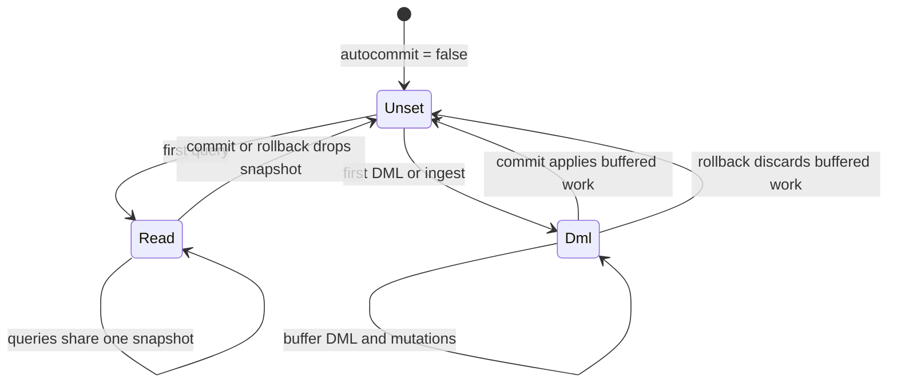

# Transactions and RPC paths

This reference describes the driver's transaction behavior. See [options](options.md) for
configuration and [ADBC](adbc.md) for the public interface. Client details refer to the revision
pinned in `Cargo.lock`; locate its source with `cargo metadata --format-version 1 --locked`.

## Spanner's transaction model

| Mode | Driver use | Completion |
| --- | --- | --- |
| Read/write | DML and mixed DML/mutation commits | Commit; the client can replay the transaction on `ABORTED`. |
| Read-only | Queries and metadata | No commit or rollback RPC. |
| Batch read-only | Partitioned queries | Partition tokens execute against the same session and snapshot. |
| Write-only | Mutation-only ingest commits | Explicit begin followed by a commit using the transaction id. |
| Partitioned DML | Opt-in large `UPDATE`/`DELETE` | Partitions commit independently; no explicit commit. |

Read-only transactions take no locks. Single-use reads carry their options on one request;
multi-use reads retain a transaction id and snapshot across requests. Spanner permits bounded
staleness only on single-use reads. See [Spanner transactions](https://docs.cloud.google.com/spanner/docs/transactions).

### Isolation and locking

`adbc.connection.transaction.isolation_level` configures the driver's read/write transactions.
Queries use `spanner.read.staleness` instead; mutation-only commits and partitioned DML do not
use the connection's isolation option.

| ADBC level suffix | Spanner level | Default read lock mode |
| --- | --- | --- |
| `default`, `serializable`, `linearizable` | `SERIALIZABLE` | Pessimistic |
| `repeatable_read`, `snapshot`, `read_committed`, `read_uncommitted` | `REPEATABLE_READ` | Optimistic |

The driver leaves read lock mode unset, so Spanner derives it from isolation. Repeatable read
uses snapshot isolation and permits write skew when a statement reads rows it does not write,
including a single autocommit statement. See [isolation levels](https://docs.cloud.google.com/spanner/docs/isolation-levels)
and [transaction options](https://docs.cloud.google.com/spanner/docs/reference/rest/v1/TransactionOptions).
The mapping is implemented in [connection/exec.rs](../src/connection/exec.rs).

## ADBC transactions

Autocommit is enabled by default. Queries use single-use read-only transactions, except a query
bound to multiple parameter rows, which shares one multi-use snapshot across those executions.
Ordinary DML runs in a read/write transaction and commits before returning.

Setting `adbc.connection.autocommit=false` enters manual mode. The pinned client exposes
read/write transactions through a replayable closure, so the driver buffers writes until commit.
The first query or write determines the transaction kind:

```mermaid
stateDiagram-v2
    [*] --> Unset: autocommit = false
    Unset --> Read: first query
    Unset --> Dml: first DML or ingest
    Read --> Read: queries share one snapshot
    Dml --> Dml: buffer DML and mutations
    Read --> Unset: commit or rollback drops snapshot
    Dml --> Unset: commit applies buffered work
    Dml --> Unset: rollback discards buffered work
```

Mixing queries and writes fails with `InvalidState`; there is no read-your-writes. Buffered DML
and ingest return `None` from `execute_update`, and commit returns no affected-row count.
DML with `THEN RETURN` and partitioned DML require autocommit.

A manual query snapshot uses the first query's staleness bound. `max:<duration>` becomes exact
staleness and `min:<timestamp>` becomes that exact timestamp; later queries' bounds are ignored.
`execute_partitions` always creates a separate batch snapshot and is rejected in a manual DML
transaction. Its staleness bound is passed through unchanged; use strong, exact staleness or an
exact timestamp because Spanner does not accept bounded staleness for that transaction type.

On commit, buffered DML runs as one `ExecuteBatchDml`, followed by any buffered mutations at
commit. Mutations therefore run after all DML, regardless of the order in which ingests and DML
were buffered. Mutation-only work uses the replay-protected write-only path. A failed commit
preserves the buffer; a successful commit removes only the applied prefix, retaining work
buffered concurrently. Re-enabling autocommit also commits pending work.

`adbc.connection.readonly=true` rejects both new writes and commits of pending writes with
`InvalidState`. It still permits rollback and completion of read-only or empty transactions.
`commit()` and `rollback()` with autocommit enabled fail with `InvalidState`.

**DDL always executes immediately**, including table creation/replacement during ingest. It
neither selects nor joins a manual transaction's kind, cannot be rolled back, and executes ahead
of previously buffered DML. A failed multi-statement schema change may leave earlier DDL applied.

Implementation: [connection.rs](../src/connection.rs), [connection/txn.rs](../src/connection/txn.rs)
and [statement.rs](../src/statement.rs).

## RPC paths

| RPC | Driver use |
| --- | --- |
| `CreateSession` | The client creates and periodically replaces its multiplexed session. |
| `BeginTransaction` | Explicit begin for write-only, batch read-only and partitioned DML; fallback when inline begin fails. |
| `ExecuteStreamingSql` | Queries, metadata, PLAN probes, partition reads, `THEN RETURN` and partitioned DML. |
| `ExecuteBatchDml` | Ordinary DML, including a single statement, and manual DML commits. |
| `Commit` | Read/write and write-only transactions. |
| `Rollback` | The client's cleanup after a non-`ABORTED` transaction-body failure. |
| `PartitionQuery` | Produces descriptors for `execute_partitions`. |
| `BatchWrite` | Opt-in autocommit ingest. |
| `UpdateDatabaseDdl` | Schema changes through the separate Database Admin API, followed by operation polling. |

The driver does not use unary `ExecuteSql`, key-based `Read`/`StreamingRead`/`PartitionRead`, or
session-pool APIs (`BatchCreateSessions`, `GetSession`, `ListSessions`, `DeleteSession`).

### Sessions and transaction begin

One cached client stack is shared by all connections from a database object; connections still
have independent ADBC transaction state. The pinned client maintains a multiplexed session,
checks its age hourly, and rotates it after seven days. There is no session pool. Setting a
database option invalidates the cache for new connections; existing connections retain their
stack. The admin client is built lazily on the first DDL operation and shared with the same stack.

Read/write and manual read-only transactions normally begin inline with their first request.
Building the manual read-only handle therefore sends no RPC. Write-only, partitioned-DML and
batch read-only transactions issue an explicit begin.

### Commit and rollback

[build_runner](../src/connection/exec.rs) centralizes read/write transaction configuration for
batch DML, returning DML and DML parameter planning. Write-only commits use the client's `write`
method: explicit begin plus `Commit(transaction_id)`, which protects against replay. The driver
does not use the client's at-least-once single-use mutation commit.

A multiplexed-session commit can require a second `Commit` carrying a precommit token; that
follow-up carries no mutations. The transaction runner separately retries whole transactions on
`ABORTED`, without a default attempt/time cap. `spanner.retry.*` does not limit those replays;
the enclosing RPC timeout does.

ADBC `rollback()` sends no rollback RPC: it discards buffered writes or drops a read-only
snapshot. The client can send `Rollback` to clean up a failed read/write transaction with an id.

### Streaming SQL and batch DML

Query results stream through bounded Arrow chunks. The pinned client resumes eligible streams
from the last resume token; long stretches without tokens can exhaust its buffering allowance
and disable resumption. An error returned before the initial stream opens is not retried by
that resumption loop. See [retry tuning](options.md#retry-tuning) for attempt and elapsed limits.

`ExecuteBatchDml` executes statements sequentially in one read/write transaction. The driver
sets `last_statements=true` for autocommit batches and `false` for manual commits. Returning DML
uses `ExecuteStreamingSql` instead and materializes returned rows inside the transaction closure.

### Partitioned queries

`execute_partitions` creates a batch read-only transaction, calls `PartitionQuery`, and obtains
the Arrow schema with a separate PLAN probe. It accepts at most one bound parameter row. A
partition descriptor carries the query and original session/transaction identity; `read_partition`
uses those identities even on another connection. Descriptors are executable and unauthenticated;
only accept them from trusted sources.

The driver exposes no partition-size/count setting: Spanner currently ignores both
[PartitionOptions hints](https://docs.cloud.google.com/spanner/docs/reference/rest/v1/PartitionOptions).
The geo-partitioning quota is unrelated to query partitions.

### BatchWrite and partitioned DML

`spanner.ingest.batch_write=true` uses one mutation group per row. Groups commit independently,
so even a single ingest chunk can partially succeed. This path has no replay protection. Manual
mode ignores the option and buffers mutations for an atomic commit.

BatchWrite receives request priority, transaction tag and change-stream exclusion. Request tags,
commit delay/stats and `spanner.retry.*` tuning do not apply; the update timeout does.

`spanner.dml.partitioned=true` opts into non-atomic, idempotent `UPDATE`/`DELETE`. It returns a
lower bound on affected rows and rejects manual mode, multiple statements/parameter rows and
`THEN RETURN`. Request priority/tag, optimizer settings, change-stream exclusion, statement
retry tuning and the update timeout apply. Commit options, transaction tags and connection
isolation do not. See [partitioned DML](https://docs.cloud.google.com/spanner/docs/dml-partitioned).

## Timeouts

| `spanner.rpc.timeout_seconds.*` class | Coverage |
| --- | --- |
| `query` | Initial query and first chunk, PLAN probes (including DML parameter planning), partition creation/initial read, and internal metadata reads. |
| `update` | DML transaction including abort replays, manual write commit, each ingest chunk, BatchWrite, partitioned DML, and DDL submission plus operation polling. |
| `fetch` | Each later streamed chunk, including subsequent bound-query executions. |

These are operation deadlines, including internal retries. Client-stack creation/session
maintenance is outside these per-operation wrappers. Manual read-only handle creation has no
wrapper because it sends no RPC. A timed-out write or DDL operation may already have applied.
See [RPC timeouts](options.md#rpc-timeouts).

## Limits and ingest budgets

Relevant [published limits](https://docs.cloud.google.com/spanner/quotas), checked September 2026:

| Limit | Value |
| --- | --- |
| Mutation API commit, including index changes | 80,000 mutations |
| One DML statement, including index changes | 80,000 mutations |
| One BatchWrite mutation group | 80,000 mutations |
| Commit payload, including indexes and change streams | 100 MiB |
| Requests other than commits | 10 MiB |
| SQL text | 1 million characters |
| DDL text for one schema change | 10 MiB |
| Concurrent partitioned-DML statements per database | 20,000 |

Mutation counts depend on affected columns, keys, generated/default columns and indexes, not
just row count. The quota page does not give a statement-count limit for `ExecuteBatchDml`, a
group-count limit for BatchWrite, or a statement-count limit for a DDL request.

The driver budgets autocommit ingest chunks at 20,000 estimated mutations and 4 MiB estimated
row data to leave headroom for indexes. A write-only chunk rejected for too many mutations is
bisected and retried down to a single row. These estimates do not guarantee a chunk fits every
server limit. Manual transactions are not split. See [statement/ingest.rs](../src/statement/ingest.rs).
